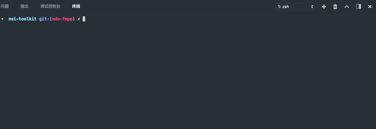

# 说明

> 为了能够让`nei-toolkit`在前后端分离实战中起到的作用更加贴切、更加符合实际使用场景。该分支的基本策略就是修复原有功能的缺陷以及渐进增强功能特点。

注: 此分支`edu-fmpp`是以分支`fmpp`为基础进行完善和定制的. 如有需要可访问原有[仓库地址](https://github.com/NEYouFan/nei-toolkit)

### 特点

> 交互命令行的方式来一键切换前后端分离模式

* `build|server`命令开放`--port`、`--reload`、`--launch`等命令参数配置，具体使用可查看下面文档.
* `server`命令新增`--launch`、`--proxy-model`、`--proxy-routes`、`--user-agent`、`--mode-on`等命令参数配置，具体使用可查看下面文档.
* `server`新增`--config-path`选项，用以开放自定义`server.config.js`配置的入口,轻松做到让`server.config.js`跟着项目走.

### 安装

```bash
npm install "techbirds/nei-toolkit#edu-fmpp" -g
```

## 指令说明

本工具使用时在终端或者命令行输入以下格式指令运行

```bash
nei [指令] [参数]
```

其中可用的指令包括：

| 指令  | 描述 |
| :--- | :--- |
| build  | 根据在 NEI 平台上定义的工程规范，生成工程的初始化目录结构 |
| update | 更新通过 `nei build` 构建的项目 |
| server | 启动本地模拟容器 |
| template | 使用本地数据解析模板 |


### build
根据在 NEI 平台上定义的工程规范，生成工程的初始化目录结构，指令的运行格式为：

```bash
nei build -k [key] [参数]
``` 

其中 [key] 是 NEI 平台上的项目的唯一标识，可以在项目的"工具(设置)"中查看

针对 `nei build` 指令可用的参数包括：

| 简写 | 全称 | 默认值 | 描述 |
| :--- | :--- | :--- | :--- |
| -h | --help |  | 显示 build 命令的帮助信息 |
| -o | --output | ./ | 指定项目的输出目录 |
| -k | --key |  | 项目的唯一标识，可以在项目的"工具(设置)"中查看 |
| -r :new: | --reload |  | 是否监听静态文件和模板文件的变化并自动刷新浏览器,默认是监听的. |
| -l :new: | --launch |  | 是否自动打开浏览器,默认是启动的. |
| -p :new: | --port |  | 端口,默认为8002 |
| -sk| --specKey |  | 规范的唯一标识，可以在规范的"规范设置"中查看 |
| -w | --overwrite | false | 是否覆盖已存在的文件，需要下载的文件不在此列，如果需要重新下载，请先将本地的文件删除 |
| 无 | --specType | web | 要构建的规范类型，目前支持 web、aos、ios、test 四种类型 |

使用范例：

在当前目录下构建 key 为 xyz 的项目：

```bash
nei build -k xyz
```

规范也可以独立于项目生成脚手架文件, 在当前目录下构建 key 为 xyz 的规范：

```bash
nei build -sk xyz
```

>注意: 如果 k 和 sk 参数同时存在, 系统会优先考虑 sk 参数

### server

启动内置的本地模拟容器

```bash
nei server [参数]
```

`nei server` 指令可用的参数包括：

| 简写 | 全称 | 默认值 | 描述 |
| :--- | :--- | :--- | :--- |
| -h | --help | | 显示 server 命令帮助信息 |
| -o | --output | ./ | 已构建项目的输出路径 |
| -k | --key |  | 需要启动的项目的唯一标识 |
| -n :new: | --name |  | 应用名称,默认app |
| -r :new: | --reload |  | 是否监听静态文件和模板文件的变化并自动刷新浏览器,默认是监听的. |
| -l :new: | --launch |  | 是否自动打开浏览器,默认是启动的. |
| -p :new: | --port |  | 端口,默认为8002 |
| -i :new: | --config-path |  | 用户自定义配置文件路径,默认为build初始生成的server.config.js文件，用户定义的配置优先级比默认配置高|
| -mo :new: | --mode-on |  | 是否启用开发模式选择,默认关闭的 |
| -pm :new: | --proxy-model |  | 是否启用远程代理模型数据,默认打开 |
| -pr :new: | --proxy-routes |  | 是否启用远程代理异步接口数据,默认打开 |
| -ua :new: | --user-agent |  | 客户端标识,默认为值pc,此外还可以取值为mobile. |

#### 范例一 命令行交互式选择开发模式

> 启动目录为 ./demo 下的项目:

```bash
nei server  -o mock/demo -r false -l false -pm false -p 8002 -pr true  -ua pc -name demo -mo
```

#### 范例二 

工程自定义配置文件`${projectRootDir}/nei.config.js`:

```js
var path = require('path');
module.exports = {
  /* 代理路由 */
  proxyRoutes: {
    "ALL /web/j/*": "http://www.icourse163.org",
    "ALL /dwr/call/plaincall/*": "http://www.icourse163.org",
  },
  /* 注入给页面的模型数据的服务器配置 */
  modelServer: {
    // 完整的主机地址，包括协议、主机名、端口
    host: 'http://www.icourse163.org',
    // 查询参数
    queries: {
      "format": "json"
    },
    // 自定义请求头
    headers: {},
    // path 可以是字符串，也可以是函数；默认不用传，即使用 host + 页面path + queries 的值
    // 如果是函数，则使用函数的返回值，传给函数的参数 options 是一个对象，它包含 host、path（页面的path）、queries、headers 等参数
    // 如果 path 的值为假值，则使用 host + 页面path + queries 的值；
    // 如果 path 的值是相对地址，则会在前面加上 host
    path: function (option) {
      "use strict";
      if ((/index\.htm/).test(option.path)) {
        return "/";
      } else {
        return false;
      }
    }
  }
};
```

```
nei server  -o mock/demo -r false -l false -pm false -p 8002 -pr true  -ua pc -name demo -mo -i ./nei.config.js
```

#### 效果示例




### update

更新通过 `nei build` 构建的项目，指令的运行格式为：

```bash
nei update [参数]
``` 

`nei update` 指令可用的参数包括：

| 简写 | 全称 | 默认值 | 描述 |
| :--- | :--- | :--- | :--- |
| -h | --help  | | 显示 update 命令的帮助信息 |
| -o | --output | ./ | 指定的项目目录 |
| -k | --key |  | 需要更新的项目的唯一标识 |
| -a | --all | false | 是否更新指定目录下面的所有项目，前提是没有指定的 key |
| -w | --overwrite | false | 是否覆盖已存在的文件，需要下载的文件不在此列，如果需要重新下载，请先将本地的文件删除 |
| 无 | --spec | false | 是否更新规范中的普通文件和文件夹，以数据填充的文件不在此列 |


使用范例：

更新当前目录下通过 `nei build` 生成的项目

```bash
nei update
```

>提示: 可以先在本地创建项目目录，然后在该目录下使用 `nei build` 和 `nei update` 命令，使用默认值即可.


### template

[详细查看](https://github.com/NEYouFan/nei-toolkit)

## FAQ

1. 暂不支持Windows下`Git Bash`的命令行交互效果. [Git Bash support on Windows](https://github.com/SBoudrias/Inquirer.js/issues/570)
2. Mac OS X下执行命令遇到权限问题，可以考虑尝试在命令前面加`sudo`  

## 感谢

* [NEI](https://nei.netease.com)
* [NEI-Toolkit](https://github.com/NEYouFan/nei-toolkit)

## 联系

此分支目前由`hzwangdong5@corp.netease.com`维护，有任何问题可以popo他.


