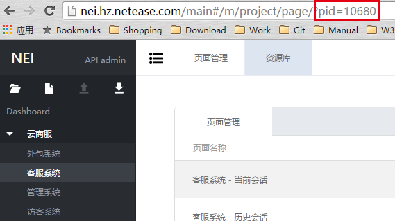
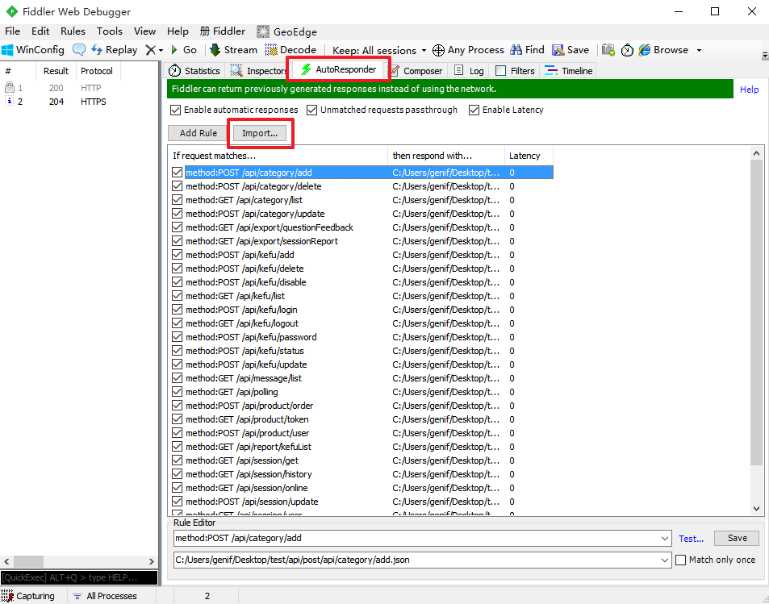
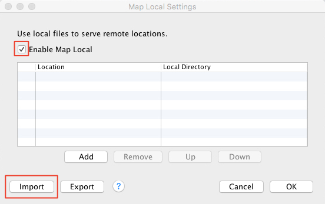

# 工具简介

本工具提供了 [NEI 平台](http://nei.hz.netease.com/) 配套的自动化功能，本工具的主要特性有：

* 支持根据 [NEI 平台](http://nei.hz.netease.com/) 定制生成项目初始结构及代码
* 支持 [本地容器 PUER](https://github.com/leeluolee/puer) 运行配置自动生成
* 支持 [NEJ 发布工具](https://github.com/genify/toolkit2) 配置文件自动生成
* 支持 [Fiddler](http://www.telerik.com/fiddler) 工具代理本地模拟数据，接口配置文件导出
* 支持 [POSTMAN](https://www.getpostman.com/) 工具接口配置文件导出
* 支持自动生成移动端数据模型、请求类代码
* 支持自动导出模拟数据

# 工具使用

## 环境配置
构建工具基于 [Node.js](http://nodejs.org/) 平台，因此需要使用者先安装 Node.js 环境，Node.js 在各平台下的安装配置请参阅官方说明。

>需要安装的 Node.js 版本须为 v4.2 及以上

## 使用说明

1.  执行以下命令安装构建工具，如果已安装构建工具可忽略此步骤

    ```bash
    npm install nei –g
    ```

    如果已安装过构建工具，则可以使用以下命令更新构建工具至最新版本

    ```bash
    npm update nei –g
    ```

2. 执行以下指令根据 NEI 平台定义的项目 ID，构建项目目录结构、模拟容器配置、模拟数据及数据过滤器

	```bash
	nei build 10680
	```

3. 如果之前已经在当前目录下构建过项目，则可以使用以下指令更新项目

	```bash
	nei update
	```

4. 如果只需要导出 NEI 平台定义的模拟数据，则可以使用以下指令

	```bash
	nei mock 10680
	```

5. 如果只需要导出 NEI 平台定义的接口的 POSTMAN 工具的配置文件，则可以使用以下指令

	```bash
	nei export 10680
	```

# 指令说明

本工具使用时在终端或者命令行输入以下格式指令运行

```bash
nei [指令] [参数]
```

其中可用的指令包括：

| 指令  | 描述 |
| :--- | :--- |
| build  | 根据 NEI 平台信息构建项目结构 |
| update | 更新通过 'nei build' 构建的项目 |
| export | 导出第三方工具的配置文件 |
| mock   | 根据 NEI 平台信息生成测试数据 |
| mobile | 根据 NEI 平台信息生成移动平台模型和请求代码 |

其中针对nei可用的参数包括：

| 简写 | 全称 | 描述 |
| :--- | :--- | :--- |
| -v | --version | 显示工具版本信息 |
| -h | --help    | 显示指定命令的帮助信息 |

使用范例：

查看工具版本信息

```bash
nei -v
```

显示工具帮助信息

```bash
nei -h
```

查看build指令帮助信息

```bash
nei build -h
```

## build

根据 NEI 平台信息构建项目结构，指令的运行格式为：

```bash
nei build <IDS> [参数]
``` 

其中 <IDS> 表示用户在 NEI 平台上定义的项目，必须输入，多个 ID 用逗号或者分号分隔，项目的 ID 可以通过 NEI 平台的访问地址栏的 pid 取到，如下图所示



>针对 nei build 指令可用的参数包括：

| 简写 | 全称 | 默认值 | 描述 |
| :--- | :--- | :--- | :--- |
| -h | --help |  | 显示build命令的帮助信息 |
| -p | --project | ./ | 指定项目目录，默认为当前目录 |
| -t | --template | webapp | 指定用于构建的模板实现文件 |
| -w | --overwrite | false | 是否覆盖已存在的 MOCK 数据文件 |
| -c | --config | | 参数配置文件路径，避免命令行参数太多导致书写不便 |

>以下参数对于使用 webapp 模板的项目特有：

| 简写 | 全称 | 默认值 | 描述 |
| :--- | :--- | :--- | :--- |
| 无 | --engine | | 如果使用内建的 webapp 模板构建，此参数用于指定使用的模板引擎，支持内建模板引擎：freemarker、velocity、其他 Node.js 模板引擎，默认为 freemarker 引擎 |
| 无 | --webRoot | | 如果使用内建的 webapp 模板构建，此参数用于指定 WEBROOT 目录，默认根据 maven 目录结构规范，相对于 -p 路径的 src/main/webapp/ |
| 无 | --viewRoot | | 如果使用内建的 webapp 模板构建，此参数用于指定服务器端视图模板目录，默认根据 maven 目录结构规范，相对于 -p 路径的 src/main/webapp/WEB-INF/views/ |

>以下参数对于使用 mobile 模板的项目特有：

| 简写 | 全称 | 默认值 | 描述 |
| :--- | :--- | :--- | :--- |
| -tp | --templatePath | | 模板路径，默认为空，使用时必须指定 |
| -tdp | --templateDataPath | | 模板的数据文件路径，默认为空，文件内容须是有效的 json |
| -pt | --projectType | hz.netease | 项目类型 |
| l | --lang | oc | 要导出的语言标识，支持的语言有 oc、java 等 |
| 无 | --reqAbstract | BaseRequest | 请求基类名称，不带类名的前缀。如果语言是 java，则默认值为 BaseHttpStringRequestTask |
| 无 | --modelAbstract | HTTPModel | 数据模型基类名称，不带类名的前缀 |
| 无 | --resOut |  | 生成的 NEI 资源相对工程的路径，如不指定，语言为 Java 时值为 'app/src/main/hthttp-gen/'，语言为 Objective-C 时值为'{产品名}+/NetWork/' |

>以下参数在生成 mobile 项目的 Objective-C 模型和请求文件时特有：

| 简写 | 全称 | 默认值 | 描述 |
| :--- | :--- | :--- | :--- |
| 无 | --namePrefix | HT | 生成的文件名、类名的前缀，默认为 HT |
| 无 | --reqHeaders | Requests | 包含所有数据请求的头文件名称，不带类名的前缀 |
| 无 | --modelHeaders | Models | 包含所有数据模型的头文件名称，不带类名的前缀 |

>以下参数在生成 mobile 项目的 Java 模型和请求文件时特有： 

| 简写 | 全称 | 默认值 | 描述 |
| :--- | :--- | :--- | :--- |
| 无 | --appPackage | com.netease | 应用的包名 |
| 无 | --modelPackage | hthttp.model | 模型的相对包名 |
| 无 | --reqPackage | hthttp.httptask | http请求的相对包名 |

使用范例：

在当前目录下构建两个项目（id 为 23456798 和 452178），并强行覆盖本地模拟数据文件

```bash
nei build 23456798,452178 -w
```

在指定的目录 /path/to/project/ 下生成 id 为 23456798 的项目结构

```bash
nei build 23456798 -p /path/to/project/
```

## update

更新通过 'nei build' 构建的项目，指令的运行格式为：

```bash
nei update [IDS] [参数]
``` 

其中 [IDS] 表示 NEI 平台中对应的项目 ID，多个项目 ID 用逗号分隔，不传则表示更新所有已通过 'nei build' 生成的项目

针对 nei update 指令可用的参数包括：

| 简写 | 全称 | 描述 |
| :--- | :--- | :--- |
| -h | --help    | 显示 update 命令的帮助信息 |
| -p | --project | 指定项目目录，默认为当前目录 |
| -w | --overwrite | 是否覆盖已存在的 MOCK 数据文件，默认不覆盖 |

使用范例：

更新当前目录下所有通过 'nei build' 生成的项目

```bash
nei update
``` 

更新指定目录 /path/to/project/ 下 ID 为 1245687 的项目

```bash
nei update 1245687 -p /path/to/project/
```

## mock

根据 NEI 平台信息生成测试数据，指令的运行格式为：

```bash
nei mock <ID> [参数]
```

其中 <ID> 为 NEI 平台中对应的项目 ID，必须输入

针对 nei mock 指令可用的参数包括：

| 简写 | 全称 | 默认值 | 描述 |
| :--- | :--- | :--- | :--- |
| -h | --help | | 显示 mock 命令的帮助信息 |
| -o | --output | ./ | 指定输出目录，默认为当前目录 |
| -w | --overwrite | false | 是否覆盖已存在的 MOCK 数据文件，默认不覆盖 |
| -t | --type | 0 | 要导出的数据类型，0：模板+接口，1：模板，2：接口，默认为 0 |
| -f | --fiddler | false | 如果 type 是 0 或者 2 的情况可以用此参数配置是否导出 fiddler 配置文件，默认不导出 |
| -c | --charles | false | 如果 type 是 0 或者 2 的情况可以用此参数配置是否导出 charles 配置文件，默认不导出 |

使用范例：

在当前目录下生成项目 106764 的模版和接口的模拟数据

```bash
nei mock 106764
```

在指定目录 /path/to/output/ 下生成接口的模拟数据和 Fiddler 工具的配置文件

```bash
nei mock 233454 -t 2 -o /path/to/output/
```

导出的 fiddler 配置文件可以通过以下方式导入 [Fiddler](http://www.telerik.com/fiddler) 工具



导出的 Charles 配置文件可以通过以下方式导入 [Charles](https://www.charlesproxy.com/) 工具:

选择 Tools --> Map Local...



## export

导出第三方工具的配置文件，指令的运行格式为：

```bash
nei export <IDS> [参数]
```

其中 &lt;IDS&gt; 表示 NEI 平台中对应的项目 ID，多个项目 ID 用逗号分隔，必须输入

针对 nei export 指令可用的参数包括：

| 简写 | 全称 | 描述 |
| :--- | :--- | :--- |
| -h | --help    | 显示 export 命令的帮助信息 |
| -d | --domain  | 指定服务器的域名、端口，默认为 localhost |
| -o | --output  | 指定输出目录，默认为当前目录 |
| -w | --overwrite | 是否覆盖已存在的配置文件，默认不覆盖 |
| -t | --type    | 要导出的配置文件类型，后续扩展，0：POSTMAN，默认为 0 |

使用范例：

在当前目录下导出项目 2345,6798 的 postman 工具接口配置文件

```bash
nei export 2345,6798
```

在 /path/to/output/ 目录下导出项目 23456798 的 postman 工具接口配置文件

```bash
nei export 23456798 -d https://10.256.7.23:8080 -o /path/to/output/
```

导出的 postman 配置文件可以通过以下方式导入 [POSTMAN](https://www.getpostman.com/) 工具


## mobile

自动生成移动平台数据模型和请求类代码

```bash
nei mobile <ID> [参数]
```

其中 &lt;ID&gt; 是 NEI 平台中对应的项目 ID，必须输入

>针对nei mobile指令可用的参数包括：

| 简写 | 全称 | 默认值 | 描述 |
| :--- | :--- | :--- | :--- |
| -h | --help | | 显示 mobile 命令帮助信息 |
| -o | --output | | 指定输出目录，默认为当前目录 |
| -w | --overwrite | false | 是否覆盖已存在的配置文件，默认不覆盖 |
| l | --lang | oc | 要导出的语言标识，支持的语言有 oc、java 等 |
| 无 | --author | netease | 注释中作者姓名 |
| 无 | --reqAbstract | BaseRequest | 请求基类名称，不带类名的前缀。如果语言是 java，则默认值为 BaseHttpStringRequestTask |
| 无 | --modelAbstract | HTTPModel | 数据模型基类名称，不带类名的前缀 |
| 无 | --resOut |  | 生成的 NEI 资源相对工程的路径，如不指定，语言为 Java 时值为 'app/src/main/hthttp-gen/'，语言为 Objective-C 时值为'{产品名}+/NetWork/' |

>以下参数在生成 Objective-C 模型和请求文件时特有：

| 简写 | 全称 | 默认值 | 描述 |
| :--- | :--- | :--- | :--- |
| 无 | --namePrefix | HT | 生成的文件名、类名的前缀，默认为 HT |
| 无 | --reqHeaders | Requests | 包含所有数据请求的头文件名称，不带类名的前缀 |
| 无 | --modelHeaders | Models | 包含所有数据模型的头文件名称，不带类名的前缀 |

>以下参数在生成 Java 模型和请求文件时特有：

| 简写 | 全称 | 默认值 | 描述 |
| :--- | :--- | :--- | :--- |
| 无 | --appPackage | com.netease | 应用的包名 |
| 无 | --modelPackage | hthttp.model | 模型的相对包名 |
| 无 | --reqPackage | hthttp.httptask | http请求的相对包名 |

使用范例

在当前目录下导出项目 2345 的 Objective-C 语言的数据模型和请求对象

```bash
nei mobile 2345
```

在 /path/to/output/ 下导出项目 23456798 的 Java 语言的数据模型和请求对象

```bash
nei mobile 23456798 -l java -o /path/to/output/
```

# 版本历史

## 0.2.2   (2016-01-06)

* 生成 iOS 工程模板时，自动更新项目的 pbxproj 文件
* 更新 bower.json 模板中 express-freemarker 下载地址

## 0.2.1   (2015-12-30)

* mock 数据优先使用 NEI 上配置的默认值
* 生成 Android 工程模板并集成 Requests 和 Models 文件
* 生成 iOS 工程模板并集成 Requests 和 Models 文件
* 修正 webapp 模板中模块基类的 JS 错误

## 0.2.0   (2015-12-08)

* 支持 Objective-C 语言 Mobile 数据模型导出
* 支持 Objective-C 语言 Mobile 请求对象导出

## 0.1.9   (2015-11-11)

* 修正模板中 NEJ 路径错误

## 0.1.7   (2015-11-05)

* 输出 release.conf 文件名带 NEI ID
* 修正循环引用识别异常

## 0.1.6   (2015-10-23)

* 更新时不重新构建 WEBAPP 目录
* 更新 release.conf 模板
* 修正 postman 导出没有 updateTime 异常

## 0.1.5   (2015-10-17)

* 修正 GET 请求 postman 配置文件错误
* 支持模拟数据动态更新

## 0.1.4   (2015-10-16)

* 更新 release.conf 模板
* 调整 util.js 模板中使用的模板路径用 puer.js 的配置
* 调整 DIR_SOURCE_TP, DIR_OUTPUT_TP 路径的输出格式
* 重写参数解析规则，简写采用配置形式
* 支持 export 指令，默认导出 POSTMAN 配置文件
* NEI 平台数据导出接口兼容性调整
* 增加离线配置

## 0.1.2   (2015-08-29)

* 修正 NEI 获取数据结果的错误
* 更新 release.conf 模板文件
* 更新 mcss 默认配置

## 0.1.1   (2015-08-25)

* 修正页面入口模板错误
* 修正 puer 路由配置异常
* 修正数组循环引用错误

## 0.1.0   (2015-08-22)

* 调整 webapp 系统默认模板输出路径
* update 时不再重新生成 release.conf文件
* 修正请求 method 异常
* 本地容器配置输出先 check 文件是否存在

## 0.0.8   (2015-08-20)

* 增加 mock 指令单独导出模拟数据
* 增加 fiddler 配置支持配置文件导出

## 0.0.7   (2015-08-19)

* 支持多个 NEI 项目 build 在相同目录下
* 修正配置文件异常
* 服务器启动脚本增加 mcss 启动

## 0.0.4   (2015-08-18)

* 修正容器配置文件生成模板
* 增加模板引擎输入支持
* 增加 mcss 代码
* 重置容器配置信息
* 修改容器路由生成异常

## 0.0.1

* 初始版本

