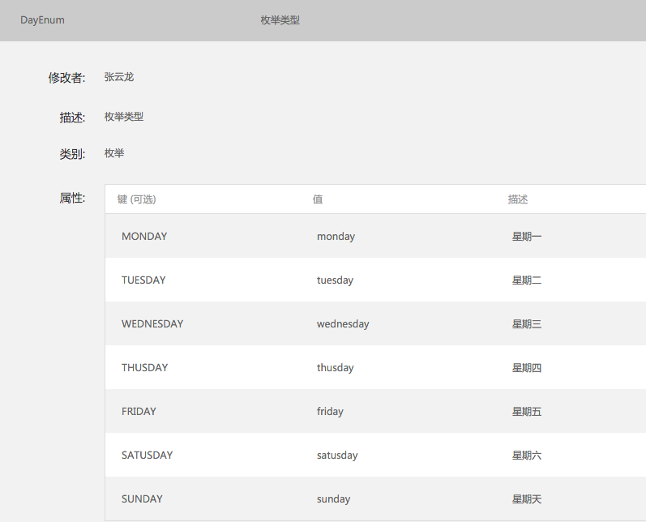
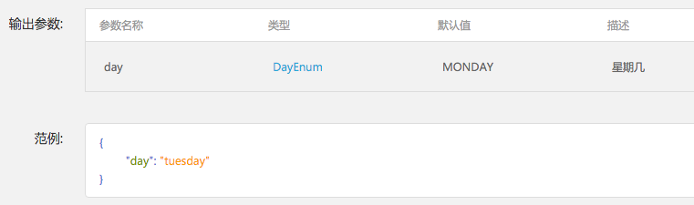
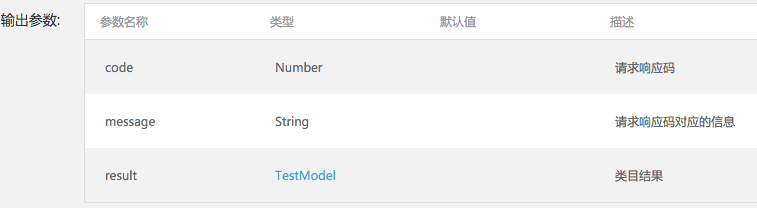
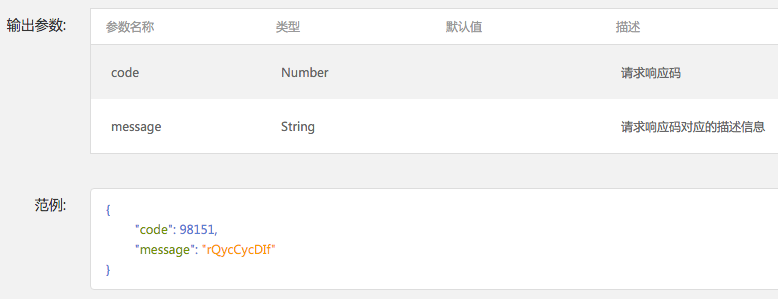
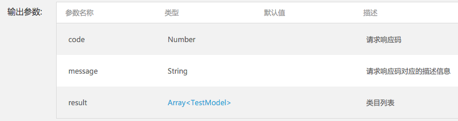
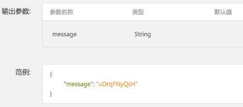
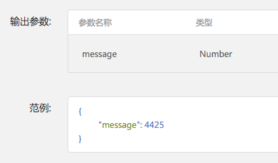
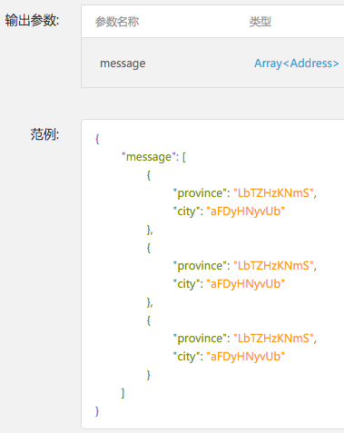

# Android 客户端代码自动生成规则
## 一、Model 生成规则
### 1. 类型对应关系与属性修饰符

Model 与 NEI 中的自定义数据类型一一对应，对每一个自定义的数据类型，都需要生成对应的 Model。每个model都继承自HTBaseModel, 基类中含有版本号等共有字段，另外需要在每个model定义文件的上面 `import com.netease.hthttp.model.HTBaseModel;`

类型的对应关系以及属性修饰符描述如下：

| NEI 数据类型  | Java 数据类型 | 注释 |
| :--- | :--- | :---
| 自定义类型  | 同名自定义类型 | 属性修饰符全部为private，另外提供get、set方法 |
| String | String |  | 
| Number | double | 最好NEI能区分整形和浮点类型的数据 |
| Boolean | boolean | 属性名称为isXXX类型的，get方法为 public String isXXX(){ return this.isXXX; } |
| Array | java.util.List | 数据子元素的类型假设为T，则为List\<T\>，如List\<String\>，List\<Double\>，List\<Boolean\> |
| Variable | Object | 尽量避免可变类型 |
	
对应类型的生成结果如下：

```java

package com.netease.yanxuan.hthttp.model;
// com.netease.yanxuan 是包名
// 生成的文件TestModel.java在com/netease/yanxuan/hthttp/model/文件夹下
// 这里hthttp.model部分可以由用户定制

import com.netease.hthttp.model.HTBaseModel;
import java.util.List;

/** 示例
{
	  number : 1,
	  isMine : true,
	  string : "hehe",
	  array : ["1","2","3"],
	  variable : {},
	  customModel : {
	  		number : 2,
	  		isRight : false
	  }
  }
 */

public class TestModel extends HTBaseModel {
	// Number数据类型
    private double number;
    private boolean isMine;
    private String string;
	// 数组类型的数据，需要根据数组内容定义模板
	// 数组中的数据类型是number类型，则应该写成Double
	// 数组中的数据类型是布尔类型，则应该写成Boolean
    private List<String> array;
    private Object variable;
    // 因为全部model类都生成在同一个文件夹下，所以就不用使用全包名了
    private InnerModel customModel;

    public double getNumber() {
        return number;
    }

    public boolean isMine() {
        return isMine;
    }

    public String getString() {
        return string;
    }

    public List<String> getArray() {
        return array;
    }

    public Object getVariable() {
        return variable;
    }

    public InnerModel getCustomModel() {
        return customModel;
    }

    public void setNumber(double number) {
        this.number = number;
    }

    public void setIsMine(boolean isMine) {
        this.isMine = isMine;
    }

    public void setString(String string) {
        this.string = string;
    }

    public void setArray(List<String> array) {
        this.array = array;
    }

    public void setVariable(Object variable) {
        this.variable = variable;
    }

    public void setCustomModel(InnerModel customModel) {
        this.customModel = customModel;
    }
}
	
```


#### 枚举的处理

Model 中的枚举类型全部对应到 `String`

例如NEI中定义枚举类型：



生成的java代码：

```java

package com.netease.yanxuan.hthttp.model;

public interface DayEnum {
    // 星期一 /* NEI上的描述 */
    public static final String MONDAY = "monday";

    // 星期二
    public static final String TUESDAY = "tuesday";

    // 星期三
    public static final String WEDNESDAT = "wednesday";

    // 星期四
    public static final String THUSDAY = "thusday";

    // 星期五
    public static final String FRIDAY = "friday";

    // 星期六
    public static final String SATUSDAY = "satusday";

    // 星期天
    public static final String SUNDAY = "sunday";
}

```

>注意： 定义枚举类型的是interface，而不是class，也不是enum


* 枚举类型在输出代码中的使用




```java

private String day;

public String getDay() {
	return day;
}

public void setDay(String day) {
	this.day = day;
}


```

>对于定义枚举类型的变量，在输出的java代码定义为String

#### 不支持的 Case

NEI 定义中不包括字典类型(各种`Map`、`SparseArray`)、`Date` 类型，不需要额外处理。字典类型一定会组装成为一个 Model; `Date` 会由 `Number` 或者 `String` 来表达。

### 2. Model 类的生成规则

#### 命名规则

- 属性名字与 NEI 上的变量命名相同
- 基本类型遵循上述第 1 节的规则
- 自定义类型名，即生成的 Model 名，就是 NEI 上的类型名，该文件的包名默认为${应用包名}.hthttp.model，其中hthttp.model部分用户可以配置
- 生成的 Model 文件名和类名一致
- 生成的 Model 文件在包名定义的文件夹目录下

例如：

NEI 上的类型名为 `Company`, 则生成的类型名字 `Company`, 文件名为 `Company.java`, 包名为`com.netease.yanxuan.hthttp.model`, 则文件位置`com/netease/yanxuan/hthttp/model/Company.java`

#### 注释规则

- 在类型定义前面添加json示例
- 在每个变量前面添加每个参数的注释，从 NEI 中的参数描述中拷贝过来

## 二、HttpTask 生成规则

### 命名规则

+ HttpTask 类名从 NEI 中的接口名字中取，如NEI上的接口名称为 `Login`，则类名为 `LoginHttpTask`
+ 默认包名为 ${应用包名}.hthttp.httptask，文件位置和名称为 ${应用包名指定的目录}/hthttp/httptask，其中 `hthttp.httptask` 用户可配置
+ 如果接口名字含有中文，则使用接口地址的 camelCase 格式
+ Request 类名和文件名保持一致


### java文件

get请求示例：

```java

package com.netease.yanxuan.hthttp.httptask;

import com.alibaba.fastjson.JSONArray;
import com.alibaba.fastjson.JSONObject;
import com.netease.hthttp.BaseHttpStringRequestTask;
import com.netease.volley.Request;
import com.netease.yanxuan.hthttp.model.InnerModel;
import com.netease.yanxuan.hthttp.model.TestModel;

import java.util.List;

public class GetExampleHttpTask extends BaseHttpStringRequestTask {

    public GetExampleHttpTask(double param1,      // 注释，NEI上的变量描述   /* number 类型的输入 */
                              String param2,      // 注释，NEI上的变量描述   /* string 类型的输入 */
                              Boolean param3,     // 注释，NEI上的变量描述   /* boolean 类型的输入 */
                              InnerModel param4,  // 注释，NEI上的变量描述   /* 自定义类型 类型的输入 */
                              List<String> param5) { // 注释，NEI上的变量描述   /* 数组 类型的输入 */

        /* 请求方法类型 */
        super(Request.Method.GET);
        /* 在url后面添加参数 */
        mQueryParamsMap.put("param1", Double.toString(param1));
        mQueryParamsMap.put("param2", param2);
        mQueryParamsMap.put("param3", Boolean.toString(param3));
        mQueryParamsMap.put("param4", JSONObject.toJSONString(param4));
        mQueryParamsMap.put("param5", JSONArray.toJSONString(param5));
    }


    /* 请求完整url，不包含url后面的参数 */
    /*
    @Override
    public String getUrl() {
        return "/xhr/mobile/getexample.json";
    }
    */

    /* 请求url，不包含前面的host，不包含url后面的参数 */
    @Override
    protected String getApi() {
        return "/xhr/mobile/getexample.json";
    }


    @Override
    public Class getModelClass() {
        return TestModel.class;
    }
}

```

说明

- `BaseHttpStringRequestTask` 是默认基类，用户可配置, 需要添加 `import com.netease.hthttp.BaseHttpStringRequestTask;`

- 如用户配置的是全路径, `com.netease.yanxuan.http.wzp.BaseWzpRequestTask`，则需要修改为 `extends BaseWzpRequestTask`; 添加 `import com.netease.yanxuan.http.wzp.BaseWzpRequestTask;`

- 如果输入参数 ( url 参数或者 header ) 中有基本类型: `double`、`boolean`, 则导入
`import com.alibaba.fastjson.JSONObject;`

- 如果输入参数（url参数或者header）中有数组类型 : `List`, 则导入?`import com.alibaba.fastjson.JSONArray;`

- 其他自定义类型，需要导入对应的包名，如 `import com.netease.yanxuan.hthttp.model.TestModel;`

post请求示例：

```java

package com.netease.yanxuan.hthttp.httptask;

import com.alibaba.fastjson.JSONArray;
import com.alibaba.fastjson.JSONObject;
import com.netease.hthttp.BaseHttpStringRequestTask;
import com.netease.volley.Request;
import com.netease.yanxuan.hthttp.model.InnerModel;
import com.netease.yanxuan.hthttp.model.TestModel;

import java.util.List;

public class PostExampleHttpTask extends BaseHttpStringRequestTask {
    public PostExampleHttpTask(double param1,      // 注释，NEI上的变量描述   /* number 类型的输入 */
                               String param2,      // 注释，NEI上的变量描述   /* string 类型的输入 */
                               Boolean param3,     // 注释，NEI上的变量描述   /* boolean 类型的输入 */
                               InnerModel param4,  // 注释，NEI上的变量描述   /* 自定义类型 类型的输入 */
                               List<String> param5,// 注释，NEI上的变量描述   /* 数组 类型的输入 */
                               List<Double> param6) { // 注释，NEI上的变量描述   /* 数组 类型的输入 */

        super(Request.Method.POST);
        mHeaderMap.put("param1", Double.toString(param1));
        mHeaderMap.put("param2", param2);
        mHeaderMap.put("param3", Boolean.toString(param3));
        mHeaderMap.put("param4", JSONObject.toJSONString(param4));
        mHeaderMap.put("param5", JSONArray.toJSONString(param5));
        mBodyMap.put("param6", param6);
    }

    /* 请求完整url，不包含url后面的参数 */
    /*
    @Override
    public String getUrl() {
        return "http://${hostname}/xhr/mobile/getexample.json";
    }
    */

    /* 请求url，不包含前面的host，不包含url后面的参数 */
    @Override
    protected String getApi() {
        return "/xhr/mobile/postexample.json";
    }

    @Override
    public Class getModelClass() {
        return TestModel.class;
    }
}


```

上传请求示例：

```java

package com.netease.yanxuan.hthttp.httptask;

import com.netease.hthttp.HttpMethod;
import com.netease.hthttp.multipart.fileupload.http.BaseFileUploadHttpRequestTask;
import com.netease.yanxuan.hthttp.model.TestModel;

import java.io.File;
import java.util.HashMap;

/* BaseFileUploadHttpRequestTask，用户可配置
 * 如用户配置的是全路径，com.netease.yanxuan.http.wzp.BaseWzpRequestTask，则需要修改为
  * 1. extends BaseWzpRequestTask
  * 2. 添加 import com.netease.yanxuan.http.wzp.BaseWzpRequestTask; */
public class UploadExampleHttpTask extends BaseFileUploadHttpRequestTask {
    public UploadExampleHttpTask(File imageFile) {

        super(HttpMethod.PUT, new HashMap<String, File>(), null);
        mFiles.put("file", imageFile);
        mBodyContentType = "multipart/form-data";

        /* 将应用包名 com.netease.yanxuan 转为 COM_NETEASE_YANXUAN */
        mBoundary = "COM_NETEASE_YANXUAN_UPLOAD_IMAGE_BOUNDARY";
        /* "image/" 用户可配置 */
        mFileMinetype = "image/" + getFileType(imageFile);
    }

    /* 请求完整url，不包含url后面的参数 */
    /*
    @Override
    public String getUrl() {
        return "/xhr/mobile/getexample.json";
    }
    */

    /* 请求url，不包含前面的host，不包含url后面的参数 */
    protected String getApi() {
        return "api/v1/image/upload";
    }

    public Class getModelClass() {
        return TestModel.class;
    }
}

```


说明：

+ 类名按照命名规则为 `${NEI接口名}HttpTask`，文件名为 `${NEI接口名}HttpTask.java`

+ 默认包名为 `${应用包名}.hthttp.httptask`，文件路径为 `${应用包名确定的路径}/hthttp/httptask/`

+ 普通请求的默认基类为 `BaseHttpStringRequestTask `, 需要导入类 **`import com.netease.hthttp.BaseHttpStringRequestTask;`**

+ 文件上传的默认基类为 `BaseFileUploadHttpRequestTask`, 需要导入类 **`import com.netease.hthttp.multipart.fileupload.http.BaseFileUploadHttpRequestTask;`**

+ 基类全包名需要可配置，如配置的基类为 `com.netease.yanxuan.wzp.BaseWzpHttpTask`，则需要修改基类为 `BaseWzpHttpTask`，添加一句 import : `import com.netease.yanxuan.wzp.BaseWzpHttpTask;`

+ 如果 NEI 中输入的接口 url 是不包含 host 的，则实现 `getApi`, 否则实现 `getUrl`。两者取其一。值是 NEI 接口的 `path` 属性

+ 需要在 url 后面添加参数，则将参数添加至 `mQueryParamsMap`, 各种数据类型的写法参见 **get请求示例**

+ 需要在 header 中添加参数，则将参数添加至 `mHeaderMap`, 各种数据类型的写法参见 **post请求示例**

+ 需要在 body 中添加参数，则将参数添加至 `mBodyMap`, 各种数据类型的写法参见 **post请求示例**

+ 请求方法类型在 super 构造函数中设置，如 `super(Request.Method.POST);` 另外需要添加 `import com.netease.hthttp.HttpMethod;`

+ 各种请求方法对应的java代码见下表


| 请求方法  | java代码 |
| :--- | :--- |
| get | Request.Method.GET |
| post | Request.Method.POST |
| head | Request.Method.HEAD |
| delete | Request.Method.DELETE |
| put | Request.Method.PUT |


### 输出参数的情况

#### Case 1： NEI 结果输出参数有多条，仅有一个对应可变类型（非数组类型）, 所有输出参数与含有可变类型的 NEI 数据类型匹配

示例：



例如，输出参数 `JsonObject` 的最后一个属性 `result` 是一个可变类型，那么这时候只需要映射这个可变类型对应的信息，并且给出提示即可。

输出结果为：

```java

	public Class getModelClass() {
        return TestModel.class;
    }

```

如果符合这种情况但是并没有相应的result数据



```java

	public Class getModelClass() {
        return null;
    }

```

#### Case 2： NEI 结果输出参数有多条，仅有一个对应可变类型（数组类型）, 所有输出参数与含有可变类型的 NEI 数据类型匹配
示例：



例如，输出参数 `JsonObject` 的最后一个属性 `result` 是一个数组类型，那么这时候只需要映射这个数组类型中的元素对应的信息，并且给出提示即可。

输出结果为：

```java

	/* 注意并不是List.class */
	public Class getModelClass() {
        return TestModel.class;
    }

```

#### Case 3： NEI 结果输出参数有一条(非数组)或多条，但并不符合之前的code、message、result结构，所有输出参数与整个返回数据进行对应


`Address` 示例：


如图，数据类型 `Address` 包含属性 `province` 和 `city`, 即所有的输出内容与 `Address` 的定义匹配. 那么实现文件的结果为：

输出结果为：

```java

	public Class getModelClass() {
        return Address.class;
    }

```


`String` 示例：



如图，数据类型为 `String`. 那么实现文件的结果为：

输出结果为：

```java

	public Class getModelClass() {
        return String.class;
    }

```

`Number` 示例：



如图，数据类型为 `Number`. 那么实现文件的结果为：

输出结果为：

```java

	public Class getModelClass() {
        return Double.class;
    }

```

`Boolean` 示例：


如图，数据类型为 `Boolean`. 那么实现文件的结果为：

输出结果为：

```java

	public Class getModelClass() {
        return Boolean.class;
    }

```


如图，如果并没有返回数据


```java

	public Class getModelClass() {
        return null;
    }

```

#### Case 3： NEI 结果输出参数仅有一条，且为数组类型，所有输出参数与返回数组的元素进行对应

`List<Address>` 示例：



如图，数据类型 `Address` 包含属性 `province` 和 `city`, 即所有的输出内容与 `Address` 的定义匹配. 那么实现文件的结果为：

输出结果为：

```java

	public Class getModelClass() {
        return Address.class;
    }

```

其他 `List<Boolean>`, `List<Double>`, `List<String>`类似