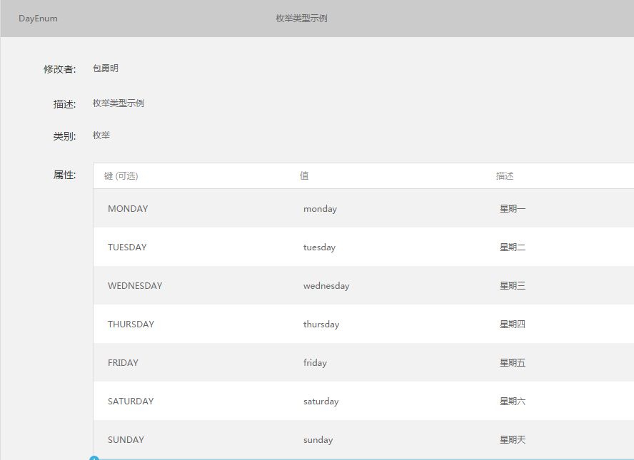

# Android 客户端代码生成规则

##### 为表达简洁起见，本文作如下说明及约定：

1. 位于 `{{` 和 `}}` 之间的是可替换内容。
2. 本文代码中的注释是辅助说明，和最终生成的代码无关。
3. `{{appPackage}}`，应用包名，通过命令行参数传入。
4. `{{modelPackage}}`，模型的相对包名，通过命令行参数传入。
5. `{{reqPackage}}`，请求的相对包名，通过命令行参数传入。
6. `{{reqAbstract}}`，请求的基类，通过命令行参数传入。
7. `{{modelAbstract}}`，模型的基类，通过命令行参数传入。

### 一、NEI 中的数据类型和 Java 语言中的数据类型的对应关系
| NEI 数据类型  | Java 数据类型 | 说明 |
| :--- | :--- | :---
| `String` | `String` | / |
| `Number` | `double` | 如果数组元素的类型为 `Number`，则为 `Double` |
| `Boolean` | `boolean` | 如果数组元素的类型为 `Boolean`，则为 `Boolean` |
| `Array` | `List` | 导入包 `java.util.List` |
| `Variable` | `Object` | 尽量避免可变类型 |
| `自定义类型` | `同名自定义类型` | 工具会生成自定义数据类型的 Model 文件 |

### 二、Model 生成规则

1. 自定义数据类型才会生成相应的 Model 文件。
2. 如果自定义数据类型中有可变类型的属性，则忽略该数据类型，即不生成相应的 Model 文件。
3. 属性有 `getter` 和 `setter` 方法。如果类型是 `Boolean`，则 `getter` 的方法名直接使用属性名。
4. 属性的修饰符为 `private`，`getter` 的修饰符为 `public`，`setter` 的修饰符是 `public void`。
5. 属性如果是枚举类型，则将其转换为 `String` 类型（待测试）。
5. 枚举类型的生成规则稍有不同，详见示例 2。

示例 1：

```java

package {{appPackage}}.{{modelPackage}};

// Model 基类，固定写死
import com.netease.hthttp.model.HTBaseModel;
// 如果有数组类型，就导入下面这个包
import java.util.List;

public class TestModel extends HTBaseModel {
    private double number;
    private boolean isMine;
    private String string;
    private CustomModel customModel;
    // 其他情况：List<Double>, List<Boolean>, List<Author>, etc...
    // 注意：数组元素的类型如果是数字或者布尔，则首字母大写
    private List<String> array;
    // day 在 NEI 中定义为枚举类型，将其转换为 `String`
    private String day;

    public double getNumber() {
        return number;
    }

    public boolean isMine() {
        return isMine;
    }

    public String getString() {
        return string;
    }

    public CustomModel getCustomModel() {
        return customModel;
    }

    public void setNumber(double number) {
        this.number = number;
    }

    public List<String> getArray() {
        return array;
    }

    public String getDay() {
    	return day;
    }

    public void setIsMine(boolean isMine) {
        this.isMine = isMine;
    }

    public void setString(String string) {
        this.string = string;
    }

    public void setCustomModel(CustomModel customModel) {
        this.customModel = customModel;
    }

    public void setArray(List<String> array) {
        this.array = array;
    }

    public void setDay(String day) {
    	this.day = day;
    }
}

```

示例 2，枚举类型：

假设在 NEI 中定义的枚举类型如下图所示：



则生成的 Java 代码如下：
```java

package {{appPackage}}.{{modelPackage}};

public interface DayEnum {
    // 星期一 /* 此处为 NEI 上的描述 */
    public static final String MONDAY = "monday";

    // 星期二
    public static final String TUESDAY = "tuesday";

    // 星期三
    public static final String WEDNESDAT = "wednesday";

    // 星期四
    public static final String THUSDAY = "thusday";

    // 星期五
    public static final String FRIDAY = "friday";

    // 星期六
    public static final String SATURDAY = "saturday";

    // 星期天
    public static final String SUNDAY = "sunday";
}

```

>注意: 定义枚举类型时使用 `interface`，而不是 `class`，也不是 `enum`。
