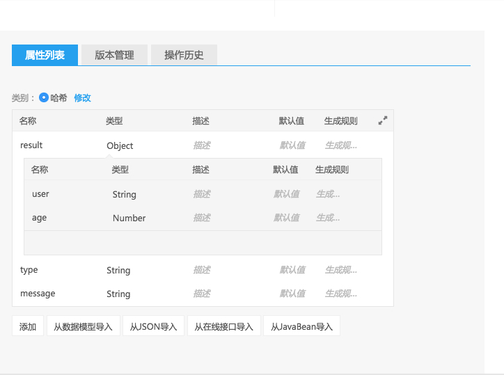

NEI平台目前支持Swagger和NEI自定义的开放标准来批量导入接口。

## Swagger格式导入

在导入Swagger接口前， 如果不是类似于Swagger服务自动生成而是自己手写(或修改)的, 请先到[Swagger editor](https://swagger.io/swagger-editor/)中检查该规范，确保没有错误。


## NEI自定义标准批量导入接口

如果你的项目并不是使用swagger这类标准来定义接口， 此时要批量导入接口和数据类型定义，除了转换为Swagger标准(如果你熟悉它的话)，你也可以直接生成我们NEI的数据格式来实现该功能。下面将详细介绍该格式。

说明:

1. 下文所有的忽略该字段表示， 你可以不要这个字段，系统已经帮你设置好默认值

### 格式

#### 最外层数据

```text
{
  "datatypes": Array<NEIDatatype>,
  "interfaces": Array<NEIInterface>
}
```

这里以及下文均使用了TypeScript定义, 即":"的右边是该值的类型定义。比如说上面的"datatypes"， 他是一个[NEIDatatype](#neidatatype)类型的数组, interfaces是一个[NEIInterface](#neiinterface)类型的数组

你最终是要导出一个类似这样的json。
下面对各个类进行定义。

#### NEIDatatype

```TypeScript
export class Datatype{
    name: string;
    description: string;
    format: DatatypeFormatEnum;
    params: Array<Parameter>;
    tag: string;
    type: DatatypeTypeEnum;
    id?: number;
}
```

这里对每一项进行说明，

| 属性        | 含义                                                                           |
| :---        | :---                                                                           |
| name        | 该数据类型的名称，当为空的时候， 为匿名类型。 详细请看[匿名类型](#匿名类型) |
| description | 该数据类型的介绍                                                               |
| format      | 枚举值，参看 [DatatypeFormatEnum](#datatypeformatenum)                      |
| params      | 即该数据模型包含的所有参数数组,每一项的详细定义为[Parameter](#parameter)    |
| tag         | 该数据模型的分组(目前未实现该功能，暂且忽略该字段)                             |
| type        | 枚举值，参看 [DatatypeTypeEnum](#datatypetypeenum)                          |
| id          | 可选值,在创建[匿名类型](#匿名类型)时候需要，其他情况下忽略该字段             |

#### DatatypeTypeEnum

该值是对数据类型分类的定义，在NEI中，数据模型分为系统预置的系统类型、用户创建的数据类型以及 [匿名类型](#匿名类型)。
所有值如下:

|   值 | 含义               |
| :--- | :---               |
|    0 | 用户创建的数据类型 |
|    1 | 系统类型           |
|    2 | 匿名类型           |

所以在一般情况下，你设为0即可

#### Parameter
类型定义如下:
```
export class Parameter {
    name: string = "";
    description: string="";
    datatypeName?: string;
    defaultValue?: string;
    genExpression?: string; // 预留
    isArray: boolean = false;
    required: boolean = true;
    type?: number;
    typeName: string;
}
```

| 属性          | 含义                                                                                            |
| :---          | :---                                                                                            |
| name          | 该数据参数的名称，可以为空                                                                      |
| description   | 该数据类型的介绍, 可以用空                                                                      |
| datatypeName  | 导入类型的数据模型名字,详细看 [导入类型](#导入类型)                                           |
| defaultValue  | 该参数的默认值,请转换为字符串                                                                   |
| genExpression | 该参数的生成方法，用于生成mock数据，可以忽略                                                    |
| isArray       | 表明该参数是不是一个数组                                                                        |
| required      | 表明该参数是否必须                                                                              |
| type          | 该值只在创建匿名类型的时候需要，为匿名类型的id，即上面的NEIDatetype.id                          |
| typeName      | 该值的类型定义，比如系统类型"string", "number", "boolean", 以及本json创建的所有NEIDatatype.name |

这里需要注意typeName的时候，typeName实现了复用数据类型的作用，你可以创建一堆数据模型，然后在文中引用这个数据类型的name。数据模型直接的依赖顺序不需要考虑，即A写在B前面，A也能应用B。

#### DatatypeFormatEnum

该值是对数据类型自身类型的定义,在NEI上,对于一个数据模型来说，他有Hash、 Enum、File等类型。
所有值如下:

|   值 | 含义 |
| :--- | :--- |
|    0 | 映射 |
|    1 | 枚举 |
|    2 | 数组 |
|    3 | 字符 |
|    4 | 数值 |
|    5 | 布尔 |
|    6 | 文件 |


#### NEIInterface
其定义如下：

```TypeScript
export class NEIInterfaceBean {
    name: string;
    className: string;
    description: string;
    method: string;
    tags: string;
    params: NeiInterfaceParams;
    path: string;
    reqFormat: DatatypeFormatEnum;
    resFormat: DatatypeFormatEnum;
}
```
下面对各个属性进行介绍

| 属性        | 含义                                                         |
| :---        | :---                                                         |
| name        | 该接口的名称，不能为空                                       |
| description | 该接口的介绍, 不能为空                                       |
| method      | 枚举值，参看 [InterfaceMethodEnum](#interfacemethodenum)  |
| tags        | 接口分组，目前未实现该功能                                   |
| params      | 接口的参数，详看[NeiInterfaceParams](#neiinterfaceparams) |
| path        | 该接口访问路径                                               |
| className   | 该接口的代码映射                                             |
| reqFormat   | 请求参数类型，枚举值，参看 [DatatypeFormatEnum](#datatypeformatenum)  |
| resFormat   | 响应参数类型，枚举值，参看 [DatatypeFormatEnum](#datatypeformatenum)  |

#### InterfaceMethodEnum

即HTTP方法，String类型,其取值为下(必须为大写):

- GET
- POST
- HEAD
- PATCH
- PUT
- DELETE


#### NeiInterfaceParams

其定义如下:

export class NeiInterfaceParams{
    inputs: Array<Parameter> = [];
    outputs: Array<Parameter> = [];
}

| 属性    | 含义                                                    |
| :---    | :---                                                    |
| inputs  | 该接口的请求参数, 其定义参看 [Parameter](#parameter) |
| outputs | 该接口的响应参数, 其定义参看 [Parameter](#parameter) |


### 匿名类型
匿名类型是当你不想为一个嵌套的hash map创建一个单独的数据类型而设的。 在NEI平台上，表现形式为将一个参数设置为Object类型，此时你就能继续定义这个Object的键值了。如下图所示:

 在导入文件格式中，使用了一个比较tricky的方法。你需要为这个NEIDatatype设置一个小于0的id，同时将它的name设为""(空字符串), type字段设为2。 之后在每一个应用该数据模型的地方设置type为该小于0的id值。截图中对应的生成json如下，需要注意的是，第一个匿名类型的id设为-1，使用该匿名类型的result的type设为该id, 即-1。

```json
{
  "datatypes": [
    {
      "type": 2,
      "format": 0,
      "name": "",
      "id": -1,
      "params": [
        {
          "isArray": false,
          "name": "user",
          "required": true,
          "description": "",
          "typeName": "string"
        },
        {
          "isArray": false,
          "name": "age",
          "required": true,
          "description": "The type of copyright: C = the copyright, P = the sound recording (performance) copyright.",
          "typeName": "number"
        }
      ]
    },
    {
      "type": 2,
      "format": 0,
      "name": "",
      "params": [
        {
          "isArray": false,
          "name": "result",
          "required": true,
          "description": "The copyright text for this album.",
          "type": -1 // !import
        },
        {
          "isArray": false,
          "name": "type",
          "required": true,
          "description": "",
          "typeName": "string"
        },
        {
          "isArray": false,
          "name": "message",
          "required": true,
          "description": "",
          "typeName": "string"
        }
      ]
    }
  ]
}
```

### 导入类型
NEI上可以实现导入类型。我们需要对每一个 param 加上 datatypeName, 这样就能够将这些参数归类在一起。 详细看样例。


详细的样例请看[importExample](https://github.com/NEYouFan/nei-toolkit/blob/master/doc/res/importExample.json)。
如果你也是使用TypeScript, 你可以使用这个[定义文件](https://github.com/NEYouFan/nei-toolkit/blob/master/doc/res/NEIInterfaceBean.ts),方便获取上诉定义(依赖Swagger Parser NPM包)
