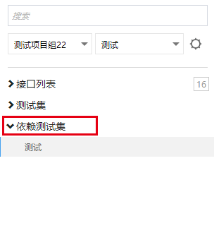
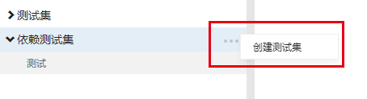
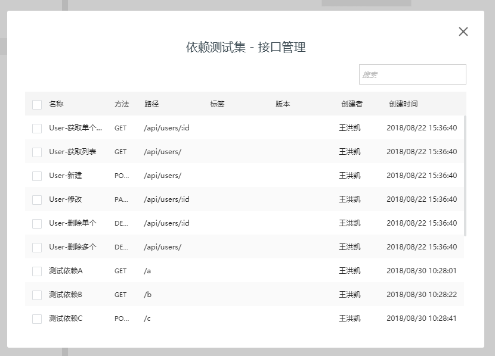
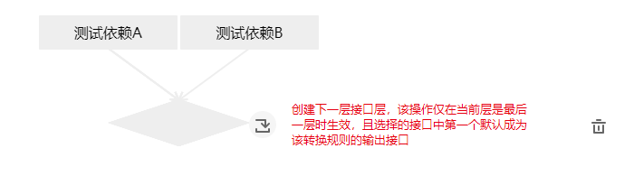
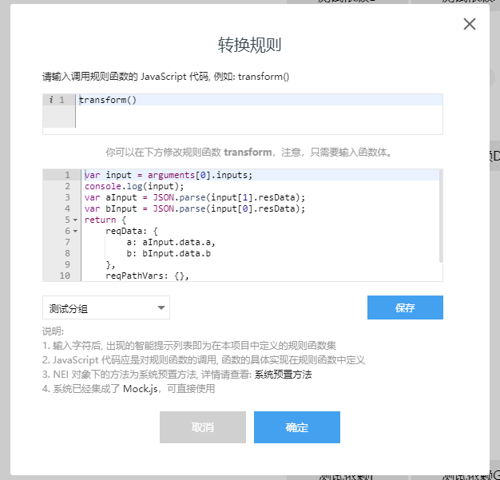
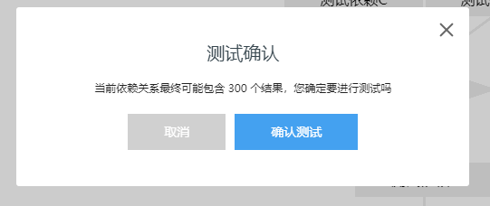
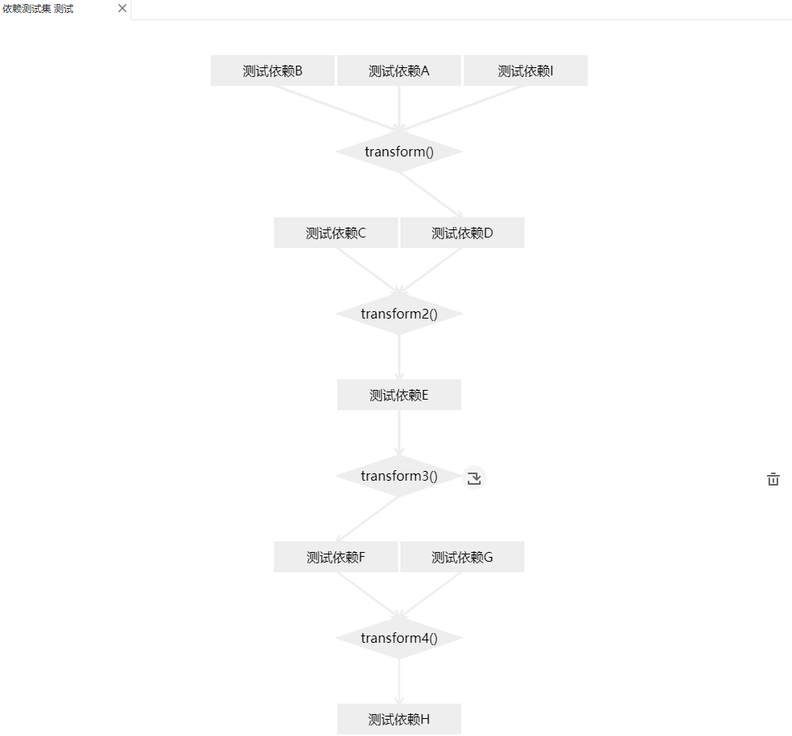
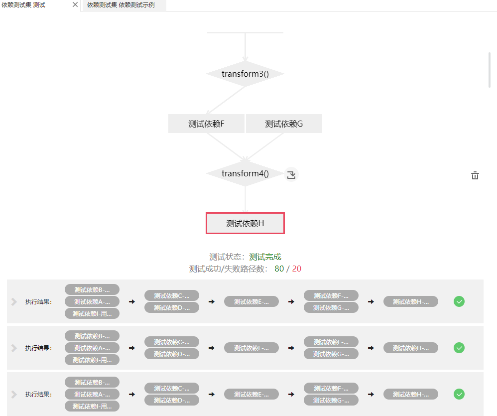
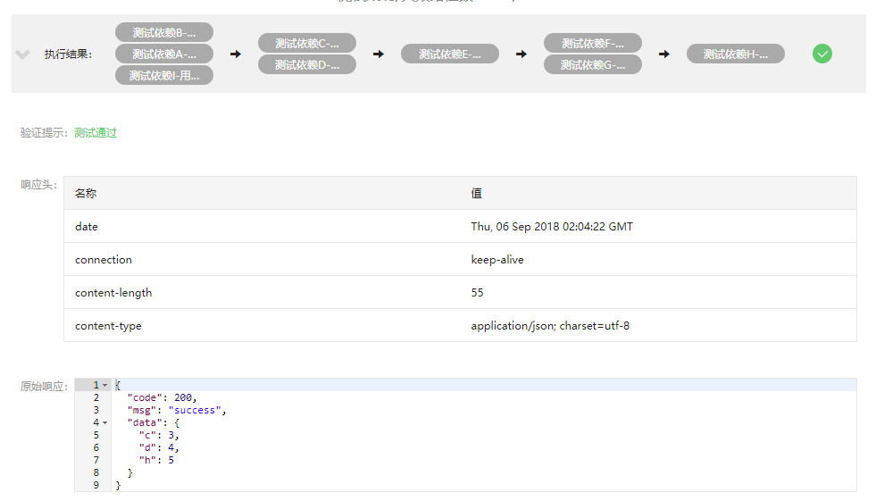
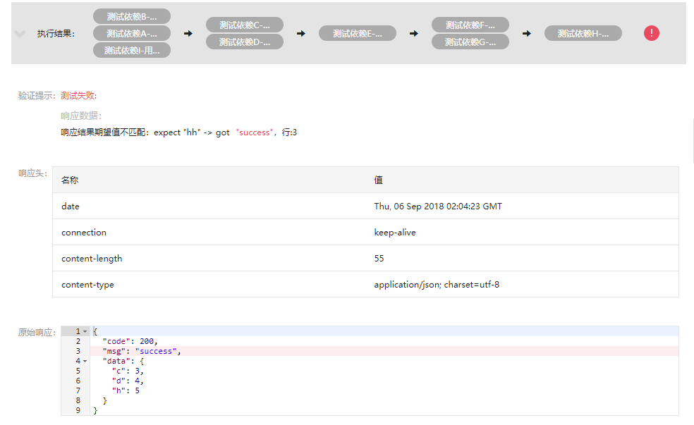

NEI 目前已经发布了接口测试的功能，以解决一些接口具有依赖关系的测试场景。

## 依赖测试入口
在接口测试的接口测试和测试集列表中新增了一个分支：依赖测试集。  
  
依赖测试集下可以查看创建的依赖测试集，也可以新增。


## 依赖测试流程
新增的依赖测试集，其初始如下图所示：
  
只有孤单的一层，点选 `+`能够新增接口。  
  
如下图新增了两个接口 A 和 B
  

### 依赖测试集依赖规范说明
- 依赖测试集其依赖关系按层来组织，以接口层开始，以接口层结束，且结束的接口层其包含的接口只能有一个
- 其中接口层承载了进行依赖测试的接口，依赖测试会使用该接口的用例进行测试，没有用例，则无法进行，请保证单独测试过该接口。转换规则层则是接受上一层接口层的输入数据，经过转换函数，输出传给下一层接受转换规则函数的接口的数据，该数据会和下一层接受规则函数接口进行合并，合并的策略为：
    - 根据返回对象的字段与原测试用例对应字段进行合并，如转换规则返回了`reqData`字段，则替换原测试用例中的`reqData`，否则则使用原有测试用例的数据。
- 依赖测试的层顺序必须严格按照一层接口层一层转换规则层来定义，否则无法进行测试，如一个合法的定义为：`接口层`-->`转换规则层`-->`接口层`
- 转换规则会接受上一层的所有成功用例数据的组合，如某转换规则层的上一层有三个接口A、B、C，三个接口分别有4、5、6个用例，若测试时全部成功，则转换规则共产生4\*5\*6=120个用例给下一层接受的接口。若C接口失败了一个用例，则最终产生的用例数为4\*5\*5=100个用例

### 转换规则规范说明
转换规则函数会接受上一层接口结果的某一个组合，该组合按照上一层的接口定义的顺序排列，你可以在这里进行数据的转换来传给下一个接口，也能更改接收接口的头和路径参数。  
其中，转换规则函数是一个函数，可以通过`arguments[0]`来取到传入的数据，传入数据中的`inputs`字段为上一层接口用例执行结果的某个组合，是一个数组。  
数组中的每一项是上一层对应顺序接口的某个用例的输出结果，其主要包含如下需关注的信息：  
- `resData`：字符串，是上一层接口用例的输出结果
- `resHeader`: 字符串，是上一层接口用例的响应头  

转换规则函数通过返回数据来改变下一层接口用例测试的输入数据，其中`reqData`为测试数据，`reqPathVars`为请求路径数据，`reqHeaders`为请求的头数据。  
如，一个合法的转换规则如下所示  
```js
function transform () {
  var input = arguments[0].inputs;
  var aInput = JSON.parse(input[1].resData);
  var bInput = JSON.parse(input[0].resData);
  return {
      reqData: {
          a: aInput.data.a,
          b: bInput.data.b
      },
      reqPathVars: {},
      reqHeaders: {}
  }
}
```

### 依赖测试集定义操作说明
鼠标移动到任意一个接口上，都能出现以下操作，点选接口，会跳转到该接口的定义
  
鼠标移动到任意一个转换规则上，都能出现一下操作，点选转换规则，可以更改转换规则
  
  
右上方的重置和开始，其中重置则是将图清空，请慎重操作。点击开始按钮则开始依赖测试。  
  
依赖测试的总用例数可能会很大，当计算出来可能达到的用例数在200以上时，则会警告测试者是否进行测试。  
  

如下图为完整的一个合法依赖关系图
  
点选开始测试进行依赖测试，测试完后，其结果如下：
  
注意：最终的路径数可能并非计算出来的数量，这是由于一旦某个用例在测试过程中失败，其结果不会传播到该层以下。  
  
结果列表中一条数据如下所示，其中鼠标移动到某路径中某用例上方能看到这条路径对应的用例是哪一个，若成功，则路径完整显示，若失败，则显示失败时的路径，方便测试人员定位错误，同时，在上方的依赖测试图，也会将出现错误的接口或转换规则标注红色，方便定位  

点开某一个结果，即可查看该结果的详情，成功或失败：
  
  