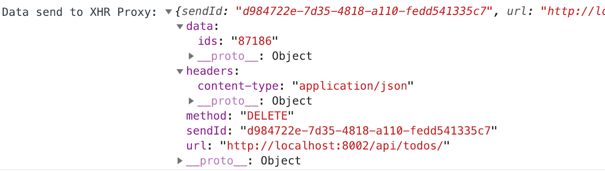
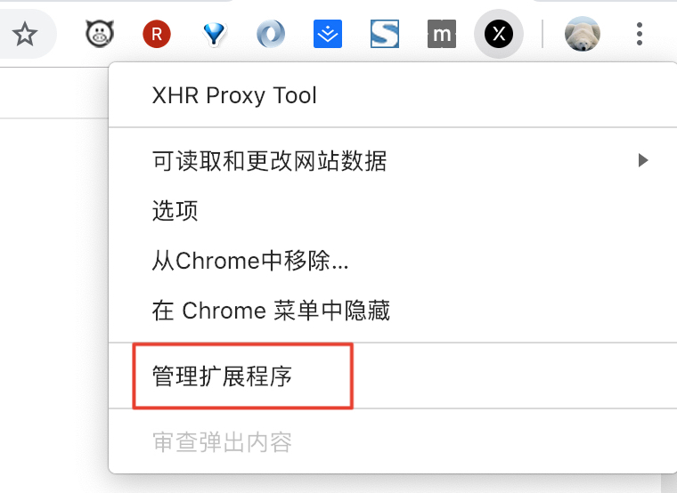
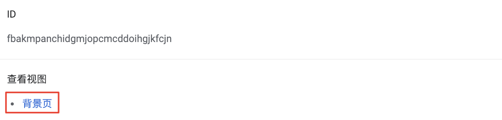

有时候，由于各种原因会导致接口测试失败，此时我们需要查看测试时实际发送了什么数据。

## 在控制台中查看

为了尽可能方便地查看发送数据，我们已经将各个阶段的日志打印在浏览器的控制台中了，类似下面的效果：

## 查看插件背景页的网络请求面板

接口测试需要安装一个浏览器插件，[XHR Proxy Tool](https://chrome.google.com/webstore/detail/xhr-proxy-tool/fbakmpanchidgmjopcmcddoihgjkfcjn)，这是一个跨域请求的插件，本地 localhost 地址也是可以直接请求到的，实际的网络请求是这个插件发出的。可以通过下面的方法查看实际的网络请求：

* 右键 Chrome 浏览器右上角的插件图标，选择“管理扩展程序”：

* 在弹出的页面中选择“背景页”：

* 弹出来的页面，是一个浏览器的开发者工具面板，切换到 Network 面板，就可以看到插件发出的实际请求信息了。