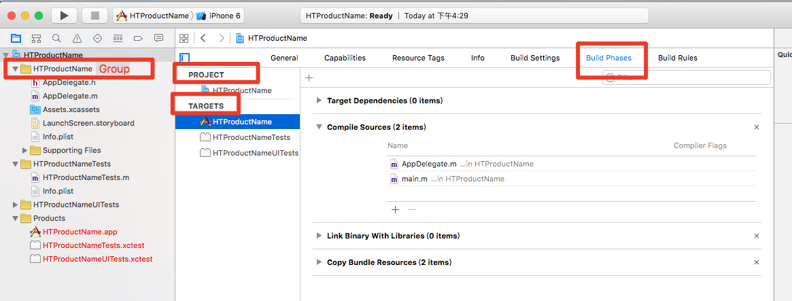

# Xcode Project File Format

## 概述
Xcode工程文件是一种旧式风格的plist文件（基于括号来界定配置内容层级结构）, 文件名固定为project.pbxproj。project.pbxproj以一个显式的编码信息开头，通常为UTF-8编码，如下：

	// !$*UTF8*$!

### 总体结构
工程文件的总体结构如下所示; 核心是objects, 暂时省略了其中的内容。

	// !$*UTF8*$!
	{
		archiveVersion = 1;
		classes = {
		};
		objectVersion = 46;
		objects = {
		...
		}
		rootObject = E6A557831C22979700A81AD5 /* Project object */;
	}

objects中包含了多个Section, 也就是多种类型的信息，每一条信息都可以看作是一个object或者称之为element; 然后objects就包含了所有的这些object信息, 为统一起见，本文将每一条具体的信息称为一个Element(元素). 这个总体的描述也可以看作一个Element, 称作Root Element. （Note: 如果通过脚本生成或者修改project.pbxproj的内容，建议严格大小写敏感，个人经验表明在Xcode图形化界面中修改文件名的大小写基本不生效）.

各部分的描述如下：

| Attribute  | Type | Value |  Comment |
| :--- | :--- | :--- | :------
| `archiveVersion` | `Number` | 1 | 默认值 |
| `classes	List` | `Empty` |  |
| `objectVersion` | `Number` | See XcodeCompatibilityVersion enumeration. |  |
| `objects` | `Map` | A map of element | The map is indexed by the elements identifier  |
| `rootObject` | `Reference` | An element reference | The object is a reference to a PBXProject element. |

工程文件的主要配置信息都是在objects中.

一般，rootObject对应的就是`PBXProject` Element, 也就是注释中所说的Project object, 因此，这个uuid的值`E6A557831C22979700A81AD5`就是对应的 `PBXProject`的值，可以在`PBXProject` Section中找到对应的描述.

### Unique Identification
objects里面实际上是一个元素的Map, 每个Key用一个全文档唯一的uuid来表示，例如上面的例子中，rootObject的uuid就是`E6A557831C22979700A81AD5`, 这个uuid在一个project文件中是唯一的，是一个24字节长的字符串，每一个字节实际上表示的是4位的二进制数，也就是说每一个字符一定是从0到F。

### Element描述
以PBXBuildFile为例,

	/* Begin PBXBuildFile section */
			E6A557901C22979700A81AD5 /* main.m in Sources */ = {isa = PBXBuildFile; fileRef = E6A5578F1C22979700A81AD5 /* main.m */; };
			E6A557931C22979700A81AD5 /* AppDelegate.m in Sources */ = {isa = PBXBuildFile; fileRef = E6A557921C22979700A81AD5 /* AppDelegate.m */; };
			E6A557951C22979700A81AD5 /* Assets.xcassets in Resources */ = {isa = PBXBuildFile; fileRef = E6A557941C22979700A81AD5 /* Assets.xcassets */; };
			E6A557981C22979700A81AD5 /* LaunchScreen.storyboard in Resources */ = {isa = PBXBuildFile; fileRef = E6A557961C22979700A81AD5 /* LaunchScreen.storyboard */; };
			E6A557A31C22979700A81AD5 /* HTProductNameTests.m in Sources */ = {isa = PBXBuildFile; fileRef = E6A557A21C22979700A81AD5 /* HTProductNameTests.m */; };
			E6A557AE1C22979700A81AD5 /* HTProductNameUITests.m in Sources */ = {isa = PBXBuildFile; fileRef = E6A557AD1C22979700A81AD5 /* HTProductNameUITests.m */; };
	/* End PBXBuildFile section */

可以看到总体结构分为如下几个部分:
1 开始段注释: `/* Begin PBXBuildFile section */`
2 每一个Element的内容:
	
	E6A557901C22979700A81AD5 /* main.m in Sources */ = {isa = PBXBuildFile; fileRef = E6A5578F1C22979700A81AD5 /* main.m */; };

每个Element实际是用Key-Value的方式描述，开头是Key也就是Element的uuid， 后面是注释， ＝ 号后面是一个哈希表描述的内容；具体到每一类元素，内容描述会不同，但基本都是以Key-Value的方式描述，如果值是uuid, 后面会带上注释，方便阅读。
3 结束段注释.

### Elements Section
本文以project文件中的section来描述不同种类的Element信息，一般Section名称和含义如下。

* Root Element: 根节点信息，其余所有的Element都包含在根节点的objects中, 在前面的总体结构中有介绍，这里不再描述.
* PBXBuildFile: 描述编译阶段的一个文件引用，包括源文件(.m)和资源文件(xib或者storyboard). 
* PBXBuildPhase:  描述编译阶段. 是一个抽象概念，实际出现的是下面具体的项目； BuildPhase对应的是Xcode图形化界面上的Build Phase配置.
	* PBXAppleScriptBuildPhase
	* PBXCopyFilesBuildPhase: 拷贝文件阶段.
	* PBXFrameworksBuildPhase: Framework编译阶段.
	* PBXHeadersBuildPhase: 头文件编译阶段.
	* PBXResourcesBuildPhase: 资源文件拷贝编译阶段.
	* PBXShellScriptBuildPhase: 脚本执行阶段.
	* PBXSourcesBuildPhase: 源文件编译阶段.
* PBXContainerItemProxy
* PBXFileElement:  描述文件，包括Group, 实际出现的是下面具体的项目.
	* PBXFileReference: 对应文件的描述，包括源文件、头文件、资源文件、库文件、Application文件等等，总之，所有在Xcode Project图形化界面中看到的文件都有对应的描述。
	* PBXGroup: 描述文件Group.
	* PBXVariantGroup: 描述本地资源文件的Group.
* PBXTarget: 描述编译目标, 具体的是下面几项。
	* PBXAggregateTarget
	* PBXLegacyTarget
	* PBXNativeTarget: 每一个库或者应用的Target, 也就是对应Xcode 图形化界面上的Target.
* PBXProject: 对应整个Porject Element.
* PBXTargetDependency: 描述Target的依赖信息.
* XCBuildConfiguration: 描述编译配置信息.
* XCConfigurationList: 每一项都是一个XCBuildConfiguration.

而以最简单的示例工程[HTProeuctName](https://git.hz.netease.com/hzwangliping/ResearchResult/blob/master/AutoGenerate/SingleView/HTProductName/HTProductName.xcodeproj/project.pbxproj)为例，则从上到下包含了如下的Section:

PBXBuildFile
PBXContainerItemProxy  
PBXFileReference   
PBXFrameworksBuildPhase 
PBXGroup   
PBXNativeTarget 
PBXProject   
PBXResourcesBuildPhase 
PBXSourcesBuildPhase  
PBXTargetDependency  
PBXVariantGroup  
XCBuildConfiguration
XCConfigurationList

可以发现，一个简单的工程中并不需要包含所有这些Section, 所包含的Section主要是描述Project, Target, Group, BuildPhase, BuildFile, Configuration这几个方面; 这几个关键概念的描述可以参照“背景知识介绍”这一节. (TODO: 添加文档内的链接跳转)

**前期重点关注`PBXBuildFile`、 `PBXFileReference`、`PBXGroup`、`PBXNativeTarget`、`PBXProject`、`PBXSourcesBuildPhase`。**

## 基本Section详细介绍

示例中为简单期间，只展示其中一个或者多个文件，而且不包括前后的注释, 重点描述各个section之间的关联关系。

### PBXBuildFile

This element indicate a file reference that is used in a PBXBuildPhase (either as an include or resource).

| Attribute	| Type	| Value	| Comment  |
| :--- | :--- | :--- | :------
| reference	| UUID	| A 96 bits identifier	| |
| isa |	PBXBuildFile |	Empty | |	
| fileRef |	Reference |	An element reference |	The object is a reference to a PBXFileReference element. |
| settings	| Map |	A map of key/value pairs for additionnal settings| |

示例：

		E6A557931C22979700A81AD5 /* AppDelegate.m in Sources */ = {isa = PBXBuildFile; fileRef = E6A557921C22979700A81AD5 /* AppDelegate.m */; };
		E6A557981C22979700A81AD5 /* LaunchScreen.storyboard in Resources */ = {isa = PBXBuildFile; fileRef = E6A557961C22979700A81AD5 /* LaunchScreen.storyboard */; };

示例说明：
其中，AppDelegate.m是源文件, 对应的类型是`Sources`, 可以根据uuid `E6A557931C22979700A81AD5` 在 `PBXSourcesBuildPhase` Section中找到对应的记录.
LaunchScreen.storyboard是资源文件，对应的类型是`Resources`, 可以根据uuid `E6A557981C22979700A81AD5`在 `PBXResourcesBuildPhase` Section中找到对应的记录.
每个`PBXBuildFile` Element内容信息中的`fileRef`对应的是这个File Reference对应的uuid信息，可以根据该uuid在 `PBXFileReference` Section中找到对应的记录.

### PBXContainerItemProxy

This is the element for to decorate a target item.

|Attribute | Type |	Value |	Comment |
| :--- | :--- | :--- | :------
|reference | UUID |	A 96 bits identifier |	
|isa |PBXContainerItemProxy	Empty |	
|containerPortal | Reference | 	An element reference | The object is a reference to a PBXProject element. |
|proxyType |  Number |	1	|
|remoteGlobalIDString |  Reference |	An element reference | A unique reference ID. |
|remoteInfo	| String |	 	 

示例：

	E6A557AA1C22979700A81AD5 /* PBXContainerItemProxy */ = {
			isa = PBXContainerItemProxy;
			containerPortal = E6A557831C22979700A81AD5 /* Project object */;
			proxyType = 1;
			remoteGlobalIDString = E6A5578A1C22979700A81AD5;
			remoteInfo = HTProductName;
		};

其中:
1 containerPortal实际引用的是对应的`PBXProject` element, 因为该uuid `E6A557831C22979700A81AD5` 就是 `PBXProject` element的uuid, 可以在`PBXProject` section中找到对应的信息. 
2 remoteGlobalIDString对应的uuid `E6A5578A1C22979700A81AD5` 与 Target 对应，可以在 `PBXNativeTarget` section中找到对应的信息, 同时也与`PBXTargetDependency` section中的Target对应。
3 自己的uuid`E6A557AA1C22979700A81AD5`与	`PBXTargetDependency` section中的targetproxy对应.

TODO: 为什么有三个Target(Product, Test, UITest)但是只有两个PBXContainerItemProxy呢？

### PBXFileReference

A PBXFileReference is used to track every external file referenced by the project: source files, resource files, libraries, generated application files, and so on.

|Attribute |	Type |	Value |	Comment |
| :--- | :--- | :--- | :------
|reference|	UUID	| A 96 bits identifier	|
|isa	| PBXFileReference	| 固定值	| |
|fileEncoding	| Number |		See the PBXFileEncoding enumeration. |
|explicitFileType	| String |		See the PBXFileType enumeration. |
|lastKnownFileType	| String	| 	See the PBXFileType enumeration. |
|name |	String	|The filename.	|
|path |	String |	The path to the filename.	|
|sourceTree |	String |	See the PBXSourceTree enumeration.|
	 
示例：

	E6A557911C22979700A81AD5 /* AppDelegate.h */ = {isa = PBXFileReference; lastKnownFileType = sourcecode.c.h; path = AppDelegate.h; sourceTree = "<group>"; };
	E6A557921C22979700A81AD5 /* AppDelegate.m */ = {isa = PBXFileReference; lastKnownFileType = sourcecode.c.objc; path = AppDelegate.m; sourceTree = "<group>"; };
	E6A557941C22979700A81AD5 /* Assets.xcassets */ = {isa = PBXFileReference; lastKnownFileType = folder.assetcatalog; path = Assets.xcassets; sourceTree = "<group>"; };
	E6A557971C22979700A81AD5 /* Base */ = {isa = PBXFileReference; lastKnownFileType = file.storyboard; name = Base; path = Base.lproj/LaunchScreen.storyboard; sourceTree = "<group>"; };

例子中分别展示了头文件(.h)、源文件(.m)和资源文件示例；这部分的fileType以及sourceTree有比较复杂的组合方式；后续在调研过程中会补充更多相关信息。**一般情况下，我们只需要操作头文件和源文件，因此参照上面头文件AppDelegate.h和源文件AppDelegate.m的FileType与sourceTree即可。**

注意：
关于path; 如果sourceTree = "<group>" (这也是源文件和目标文件的一般情况)， **那么`path`是该文件路径相对于所属'group'的路径的相对路径.**
1 例如AppDelegate.m, Parent Group所对应的本地路径与AppDelegate.m所在文件夹路径相同，因此path等同于文件名字;
2 例如parent Group文件名是Models, 对应本地目录`HTJSGeneratorCode/Models`； 文件TestViewController.m对应的本地目录`HTJSGeneratorCode/Controllers/Test/TestViewController.m`; 那么path则是二者的相对路径`../Controllers/Test/TestViewController.m`, 如下所示.

		E6B03C001C27F53800450E9E /* TestViewController.m */ = {isa = PBXFileReference; fileEncoding = 4; lastKnownFileType = sourcecode.c.objc; name = TestViewController.m; path = ../Controllers/Test/TestViewController.m; sourceTree = "<group>"; };

3 接上例，如果文件	TestViewController.m不在Models Group下，而在HTJSGeneratorCode Group下，那么path就是路径`Controllers/Test/TestViewController.m`.	

### PBXFrameworksBuildPhase

This is the element for the framewrok link build phase.

|Attribute |	Type |	Value |	Comment |
| :--- | :--- | :--- | :------
|reference|	UUID	| A 96 bits identifier	|
|isa |	PBXFrameworksBuildPhase	 | 固定值|	
|buildActionMask |	Number |	2^32-1 |	
|files	| List |	A list of element reference	The objects are a reference to a PBXBuildFile element.|
|runOnlyForDeploymentPostprocessing |	Number | 0 | 

示例：

	E6A557881C22979700A81AD5 /* Frameworks */ = {
		isa = PBXFrameworksBuildPhase;
		buildActionMask = 2147483647;
		files = (
		);
		runOnlyForDeploymentPostprocessing = 0;
	};

说明：
整体规则类似PBXSourcesBuildPhase.
每一个文件都对应PBXBuildFile中的一条记录.
		
### PBXGroup

This is the element to group files or groups.

|Attribute |	Type |	Value |	Comment |
| :--- | :--- | :--- | :------
|reference|	UUID	| A 96 bits identifier	|
|isa |	PBXGroup	 | 固定值|	
|children	| List |	A list of element reference	The objects are a reference to a PBXFileElement element.|
|sourceTree |	String | See the PBXSourceTree enumeration. | 

示例:

	E6A5578D1C22979700A81AD5 /* HTProductName */ = {
		isa = PBXGroup;
		children = (
			E6A557911C22979700A81AD5 /* AppDelegate.h */,
			E6A557921C22979700A81AD5 /* AppDelegate.m */,
			E6A557941C22979700A81AD5 /* Assets.xcassets */,
			E6A557961C22979700A81AD5 /* LaunchScreen.storyboard */,
			E6A557991C22979700A81AD5 /* Info.plist */,
			E6A5578E1C22979700A81AD5 /* Supporting Files */,
		);
		path = HTProductName;
		sourceTree = "<group>";
	};

其中：
1 Group与Xcode中的工程结构一一对应；
2 path描述的是相对于上一层Group的文件路径；如果没有parent group, 那么就是自己当前的文件夹路径；**(这个比较重要，但是我还没有对异常Case做确认, 这个path有可能也是不存在的)**
3 children里面可能是一个文件，也可能是一个Group, 例如`E6A5578E1C22979700A81AD5`; 如果是一个文件，那么每一个uuid对应的是`PBXFileReference` section中的一项；如果是一个Group, 那么每一个uuid对应的是`PBXGroup` section中的一项，因为实际上是构成了一个树形结构；这个属性结构与Xcode界面展示的是一一对应的;
4 通常情况下，我们需要处理的一级Group就是与工程同名的Group, 在本例中就是HTProductName, 所以一般通常的情况都是先找到该Group. **(TODO 异常Case: 理论上可能存在同名同Path的子Group, 并且从实际情况来看，真正的Root Group不是HTProductName, 一种方法是解析的时候直接构建树形结构，没有parent的即为Root Group)**
5 所有的文件都必须属于一个Group; (因此，添加文件、删除文件的时候都必须对Group进行操作)

### PBXNativeTarget

This is the element for a build target that produces a binary content (application or library).

| Attribute	| Type	| Value	| Comment|
| :--- | :--- | :--- | :------
| reference	| UUID	| A 96 bits identifier	|
| isa |	PBXNativeTarget	Empty	|
| buildConfigurationList	Reference	| An element reference| The object is a reference to a XCConfigurationList element.|
| buildPhases	| List	| A list of element reference | The objects are a reference to a PBXBuildPhase element.|
| dependencies	| List	| A list of element reference | The objects are a reference to a PBXTargetDependency element.|
| name	| String	| The name of the target.	|
| productInstallPath	| String |	The product install path |
| productName |	String |	The product name. |	
| productReference | Reference	| An element reference | The object is a reference to a PBXFileReference element. |
| productType |	String |		See the PBXProductType enumeration. |

示例:

	E6A5578A1C22979700A81AD5 /* HTProductName */ = {
		isa = PBXNativeTarget;
		buildConfigurationList = E6A557B21C22979700A81AD5 /* Build configuration list for PBXNativeTarget "HTProductName" */;
		buildPhases = (
			E6A557871C22979700A81AD5 /* Sources */,
			E6A557881C22979700A81AD5 /* Frameworks */,
			E6A557891C22979700A81AD5 /* Resources */,
		);
		buildRules = (
		);
		dependencies = (
		);
		name = HTProductName;
		productName = HTProductName;
		productReference = E6A5578B1C22979700A81AD5 /* HTProductName.app */;
		productType = "com.apple.product-type.application";
	};
	
说明：
1 描述一个编译的Target; Target可能是Application, 也可能是Libaray, 也可能是Test的Target;
2 buildConfigurationList对应的是这个Target的配置文件，也就是对应 `XCConfigurationList` section中的一项；
3 buildPhases里包含编译的不同阶段，每一项会对应一个`PBXBuildPhase`项，由于`PBXBuildPhase`只是一个抽象的概念，因此实际对应的会是`PBXResourcesBuildPhase`或者`PBXSourcesBuildPhase`等；
4 productReference对应的是`HTProductName.app`这个文件，这个是一个app文件，既然是文件，那么该uuid就是一个`PBXFileReference`中的element; 这个uuid就用来标识这个product.

### PBXProject

This is the element for a build target that produces a binary content (application or library).

|Attribute	| Type	| Value | 	Comment |
| :--- | :--- | :--- | :------
|reference	| UUID |	A 96 bits identifier	|
|isa |	PBXProject |	Empty	|
|buildConfigurationList |	Reference |	An element reference | The object is a reference to a XCConfigurationList element. |
|compatibilityVersion	| String |	A string representation of the XcodeCompatibilityVersion. |
|developmentRegion	| String |	The region of development. |
|hasScannedForEncodings	Number |	0 or 1 |	Whether file encodings have been scanned.|
|knownRegions	| List |	A list of string	| The known regions for localized files. |
|mainGroup	| Reference | 	An element reference | The object is a reference to a PBXGroup element. |
|productRefGroup |	Reference |	An element reference | The object is a reference to a PBXGroup element. |
|projectDirPath	| String |	The relative path of the project. |
|projectReferences	| Array of map |	Each map in the array contains two keys: ProductGroup and ProjectRef. |
|projectRoot | String |	The relative root path of the project |
|targets | List |	A list of element reference	The objects are a reference to a PBXTarget element.|

示例:

	E6A557831C22979700A81AD5 /* Project object */ = {
		isa = PBXProject;
		attributes = {
			LastUpgradeCheck = 0700;
			ORGANIZATIONNAME = Netease;
			TargetAttributes = {
				E6A5578A1C22979700A81AD5 = {
					CreatedOnToolsVersion = 7.0;
					DevelopmentTeam = 2D4LEJ8Z2D;
				};
				E6A5579D1C22979700A81AD5 = {
					CreatedOnToolsVersion = 7.0;
					DevelopmentTeam = 2D4LEJ8Z2D;
					TestTargetID = E6A5578A1C22979700A81AD5;
				};
				E6A557A81C22979700A81AD5 = {
					CreatedOnToolsVersion = 7.0;
					DevelopmentTeam = 2D4LEJ8Z2D;
					TestTargetID = E6A5578A1C22979700A81AD5;
				};
			};
		};
		buildConfigurationList = E6A557861C22979700A81AD5 /* Build configuration list for PBXProject "HTProductName" */;
		compatibilityVersion = "Xcode 3.2";
		developmentRegion = English;
		hasScannedForEncodings = 0;
		knownRegions = (
			en,
			Base,
		);
		mainGroup = E6A557821C22979700A81AD5;
		productRefGroup = E6A5578C1C22979700A81AD5 /* Products */;
		projectDirPath = "";
		projectRoot = "";
		targets = (
			E6A5578A1C22979700A81AD5 /* HTProductName */,
			E6A5579D1C22979700A81AD5 /* HTProductNameTests */,
			E6A557A81C22979700A81AD5 /* HTProductNameUITests */,
		);
	};
	
说明:
1 `PBXProject`就是整个文件的根节点(Root Object), 	`E6A557831C22979700A81AD5`就是root object uuid.
2 其中描述的`buildConfigurationList`、`mainGroup`、`productRefGroup`、`targets`都与各自的Section对应; 
3 其中, `mainGroup`(E6A557821C22979700A81AD5)对应的是Root Group，也就是所有Group的根节点; 而`productRefGroup`对应的是Xcode图形化界面中的`Products`这个Group; 根据mainGroup的uuid以及`PBXGroup`和`PBXFileReference`等Section可以构建出Project的文件树（Note：此文件树与实际硬盘上的文件目录树并不等价.

TODO: Attributes在原有文档中没有描述，并且hasScannedForEncodings这一项没找到.

### PBXResourcesBuildPhase

This is the element for the resources copy build phase.

|Attribute	|Type	|Value	|Comment|
| :--- | :--- | :--- | :------
|reference	| UUID |	A 96 bits identifier	|
|isa |	PBXResourcesBuildPhase | 固定名字 |
|buildActionMask |	Number |	2^32-1 |	
|files	| List	| A list of element reference	| The objects are a reference to a PBXBuildFile element.|
|runOnlyForDeploymentPostprocessing	| Number | 0 |

示例：

	E6A557891C22979700A81AD5 /* Resources */ = {
		isa = PBXResourcesBuildPhase;
		buildActionMask = 2147483647;
		files = (
			E6A557951C22979700A81AD5 /* Assets.xcassets in Resources */,
			E6A557981C22979700A81AD5 /* LaunchScreen.storyboard in Resources */,
		);
		runOnlyForDeploymentPostprocessing = 0;
	};

类似PBXSourcesBuildPhase.

### PBXSourcesBuildPhase

This is the element for the sources compilation build phase.

| Attribute	| Type	| Value	| Comment|
| :--- | :--- | :--- | :------
| reference	| UUID |	A 96 bits identifier	|
| isa |	PBXSourcesBuildPhase | 固定名字 |
| buildActionMask |	Number |	2^32-1 |	
| files	| List	| A list of element reference	| The objects are a reference to a PBXBuildFile element.|
| runOnlyForDeploymentPostprocessing	| Number | 0 |
 
示例:

	E6A557871C22979700A81AD5 /* Sources */ = {
		isa = PBXSourcesBuildPhase;
		buildActionMask = 2147483647;
		files = (
			E6A557931C22979700A81AD5 /* AppDelegate.m in Sources */,
			E6A557901C22979700A81AD5 /* main.m in Sources */,
		);
		runOnlyForDeploymentPostprocessing = 0;
	};

说明：
1 每一个Target都会有一个对应的`PBXSourcesBuildPhase` section, 即每个Target都是独立的；可以通过查找`E6A557871C22979700A81AD5` 在`PBXNativeTarget` section中找到对应的记录；
2 本Section里面包含的文件是需要编译的源文件(.m)文件；
3 添加一个源文件到工程中后，必须要将.m文件添加到对应Target的`PBXSourcesBuildPhase` section中，否则该文件不会被编译; 一般需要先在`PBXNativeTarget`中找到默认的Target然后再找到对应的`PBXSourcesBuildPhase`.
4 新建Target后一定需要新建一个`PBXSourcesBuildPhase` section.
5 不同的BuildPhase之间的区别是isa不同; 比如isa分别对应`PBXSourcesBuildPhase`和`PBXResourcesBuildPhase`.
		
		
### PBXTargetDependency

This is the element for referencing other target through content proxies.

| Attribute	| Type	| Value	| Comment|
| :--- | :--- | :--- | :------
| reference | UUID | A 96 bits identifier	|
| isa |	PBXTargetDependency	 | 固定值 |
| target | Reference |	An element reference |	The object is a reference to a PBXNativeTarget element. |
| targetProxy |	Reference |	An element reference | The object is a reference to a PBXContainerItemProxy element. |

示例：

	E6A557A01C22979700A81AD5 /* PBXTargetDependency */ = {
		isa = PBXTargetDependency;
		target = E6A5578A1C22979700A81AD5 /* HTProductName */;
		targetProxy = E6A5579F1C22979700A81AD5 /* PBXContainerItemProxy */;
	};

描述A Target 对 B Target的依赖l, uuid的对应关系直接参照上表。(TODO: 需要额外调研)

### PBXVariantGroup

This is the element for referencing localized resources.

| Attribute	| Type	| Value	| Comment|
| :--- | :--- | :--- | :------
| reference	| UUID	| A 96 bits identifier	|
| isa |	PBXVariantGroup	| 固定值 |
| children | List |	A list of element reference	The objects are a reference to a PBXFileElement element. |
| name	| String |	The filename.	|
| sourceTree |	String | See the PBXSourceTree enumeration. |	 
示例:

	E6A557961C22979700A81AD5 /* LaunchScreen.storyboard */ = {
		isa = PBXVariantGroup;
		children = (
			E6A557971C22979700A81AD5 /* Base */,
		);
		name = LaunchScreen.storyboard;
		sourceTree = "<group>";
	};

说明：描述本地资源文件的. (TODO: 还需要更多示例深入研究)
与`PBXGroup`的主要区别就是这个是用来描述本地资源文件的.

### XCBuildConfiguration

This is the element for defining build configuration.

| Attribute	| Type	| Value	| Comment|
| :--- | :--- | :--- | :------
| reference	| UUID	| A 96 bits identifier	|
| isa | XCBuildConfiguration | 固定值 |	
| baseConfigurationReference | 	String	| The path to a xcconfig file |
| buildSettings	| Map |	A map of build settings. |
| name |	String |	The configuration name.	 |

示例:

	E6A557B31C22979700A81AD5 /* Debug */ = {
		isa = XCBuildConfiguration;
		buildSettings = {
			ASSETCATALOG_COMPILER_APPICON_NAME = AppIcon;
			INFOPLIST_FILE = HTProductName/Info.plist;
			LD_RUNPATH_SEARCH_PATHS = "$(inherited) @executable_path/Frameworks";
			PRODUCT_BUNDLE_IDENTIFIER = Netease.HTProductName;
			PRODUCT_NAME = "$(TARGET_NAME)";
		};
		name = Debug;
	};
	E6A557B41C22979700A81AD5 /* Release */ = {
		isa = XCBuildConfiguration;
		buildSettings = {
			ASSETCATALOG_COMPILER_APPICON_NAME = AppIcon;
			INFOPLIST_FILE = HTProductName/Info.plist;
			LD_RUNPATH_SEARCH_PATHS = "$(inherited) @executable_path/Frameworks";
			PRODUCT_BUNDLE_IDENTIFIER = Netease.HTProductName;
			PRODUCT_NAME = "$(TARGET_NAME)";
		};
		name = Release;
	};

TODO:
1 如何判断需要哪些个XCBuildConfiguration项目呢？

### XCConfigurationList

This is the element for listing build configurations.

|Attribute	| Type |	Value |	Comment |
| :--- | :--- | :--- | :------
|reference |	UUID |	A 96 bits identifier	|
|isa |	XCConfigurationList	| 固定值 |	
|buildConfigurations |	List |	A list of element reference | The objects are a reference to a XCBuildConfiguration element. |
|defaultConfigurationIsVisible |	Number |	0 |
|defaultConfigurationName	| String |	The default configuration name, 一般为Debug或者Release. |	 
示例:

	E6A557861C22979700A81AD5 /* Build configuration list for PBXProject "HTProductName" */ = {
		isa = XCConfigurationList;
		buildConfigurations = (
			E6A557B01C22979700A81AD5 /* Debug */,
			E6A557B11C22979700A81AD5 /* Release */,
		);
		defaultConfigurationIsVisible = 0;
		defaultConfigurationName = Release;
	};

说明：
1 每个Project、Target都有一个`XCConfigurationList`项;

### 额外Section详细介绍
TODO: 待完善.

### Enumerations

#### PBXSourceTree enumeration.

* `<absolute>` for absolute paths
* `<group>` for paths relative to the group
* `SOURCE_ROOT` for paths relative to the project
* `DEVELOPER_DIR` for paths relative to the developer directory.
* `BUILT_PRODUCTS_DIR` for paths relative to the build products directory.
* `SDKROOT` for paths relative to the SDK directory.

TODO: 待完善.

## 参考资料
### 示例说明
每个Section的示例中并没有列出所有种类的文件，可以参考示例工程的设置看到完整的例子，本文档中涉及到的工程文件如下：

Empty Project: 
https://git.hz.netease.com/hzwangliping/ResearchResult/tree/master/AutoGenerate/HTProductName/HTProductName.xcodeproj

Single View Project: 
https://git.hz.netease.com/hzwangliping/ResearchResult/tree/master/AutoGenerate/SingleView/HTProductName/HTProductName.xcodeproj

代码模板中的固定字段直接参照该工程文件, 仅产品名字`HTProductName`可变, 上述工程均为支持单元测试，公司名字为Netease的默认Objetive-C工程.

### 参考文档

1 [Xcode Project File Format](http://www.monobjc.net/xcode-project-file-format.html)

2 [翻译: Xcode工程文件格式（Xcode Project File Format）详解](http://blog.csdn.net/qq_30534535/article/details/47659791) 

3 [CocoaPods组件Xcodeproj官方文档](http://www.rubydoc.info/gems/xcodeproj/Xcodeproj)

### 参考工程：

1 [CocoaPods/XcodeProj: Create and modify Xcode projects from Ruby](https://github.com/CocoaPods/Xcodeproj)

2 [Alunny/node-xcode: tools and utilities for working with xcode/ios projects](https://github.com/alunny/node-xcode)

## FAQ & TODO LIST

### 1 背景知识介绍

#### Project Target Group "Build Phases"

如图，是一个Project的图形化界面，根节点就是一个Project, 每个Project对应若干个Target, 在本例中分别有三个Target, 一个是对应的app, 一个是UnitTest, 一个是UITest, 每个Target与Products中的一个Product对应；每一个Target都有自己对应的Build Phases, 其中可以看到`Compile Sources`，实际就是对应上文所描述的`PBXSourcesBuildPhase` Section, 里面包含需要编译的源文件；本例中，这些源文件都在Group "HTProductName"下。从图中可以大致了解各项之间的关联关系。

### 2 TODO
本文暂时只涉及到了project.pbxproj, 没有涉及到project.xcworkspace, 也没有涉及到最后组成的文件夹HTProductName.xcodeproj, 也不涉及到默认生成的文件。因此可能还是需要研究命令行生成Xcode模板工程的工作.
