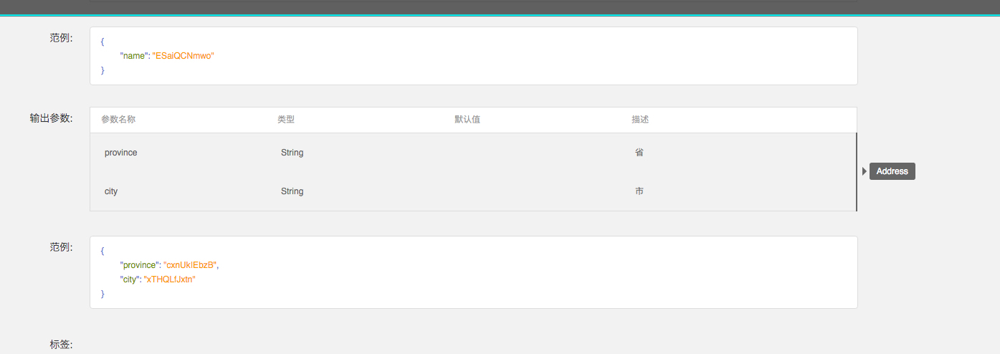
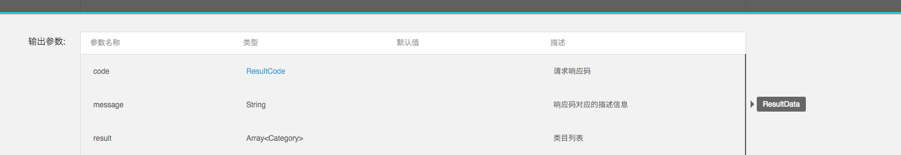

# iOS 客户端代码自动生成规则

## 一、Model 生成规则

### 1. 类型对应关系与属性修饰符

Model 与 NEI 中的自定义数据类型一一对应，对每一个自定义的数据类型，都需要生成对应的 Model。

类型的对应关系以及属性修饰符描述如下：

| NEI 数据类型  | OC 数据类型 | 注释 |
| :--- | :--- | :---
| 自定义类型  | 同名自定义类型 | 属性修饰符为 strong, 带* |
| String | NSString | 属性修饰符为 copy, 带* | 
| Number | CGFloat | 属性修饰符为 assign, 为统一，转为 OC 数据类型时都用 CGFloat, 不带* |
| Boolean | BOOL | 属性修饰符为 assign, 不带* |
| 枚举类型 | NSString | 属性修饰符为 copy, 带* |
| Array | NSArray | 属性修饰符为 strong, 并且带上类型信息, 详见下一行, 带* |
| Array<SpecVO> | NSArray<SpecVO *> | 属性修饰符为 strong, 带上类型信息, 带* |
| Variable | id | 尽量避免可变类型, 属性修饰符为 strong, 不带* |
	
对应类型的生成结果如下：

```objective-c

	@property (nonatomic, copy) NSString *userName;
	@property (nonatomic, assign) CGFloat count;
	@property (nonatomic, assign) BOOL isReady;
	@property (nonatomic, strong) HTAuthor *author;
	@property (nonatomic, strong) NSArray<HTComment *> *comments;
	
```

规则小结如下：

- `Number`，`Boolean`，用 **`assign`** 修饰，不带星号。
- `String` 用 **`copy`** 修饰，不带星号。
- 可变类型可以不用生成 Model，如果生成，对应类型为 `id`，用 **`strong`** 修饰，不带星号，如下：

```objective-c

	@property (nonatomic, strong) id result;

```

其余类型用 **`strong`** 修饰，不带星号。
 		
#### NSArray 的特殊处理

数组需要写明对应的类型，例如：

```objective-c

	Array<SpecVO>     NSArray<SpecVO *>	属性修饰符为strong, 带上类型信息, 带*

```

需要特殊处理的是，如果数组里对应的是 `Number` 或者 `Boolean`, 那么需要转为 `NSNumber`。

例如：NEI 上的一个数据类型的某个属性名字是 `numList`, 类型信息为 `Array<Number>`， 那么对应生成的属性是:


```objective-c

	@property (nonatomic, strong) NSArray<NSNumber *> *numList;

```

#### 枚举的处理

Model 中的枚举类型全部对应到 `NSString *`

#### 不支持的 Case

NEI 定义中不包括字典类型(`Hash`表)、`NSDate` 类型，不需要额外处理。字典类型一定会组装成为一个 Model; `NSDate` 会由 `Number` 或者 `String` 来表达。


### 2. Model 类生成的规则

#### 命名规则

- 属性名字与 NEI 上的变量命名相同。
- 基本类型按照上一章的规则来。
- 自定义类型名即生成的 Model 在 NEI 上类型名上加前缀 `HT`， 该前缀名可由用户配置。
- 生成的 Model 文件名和类名一致。

例如：

NEI 类型名为 `Campany`, 则生成的类型名字 `HTCompany`, 头文件为 `HTCompany.h`, 实现文件为 `HTCompany.m`

#### 头文件

示例：

```objective-c

	#import "HTHTTPModel.h"
	
	@class HTAuthor;
	@class HTComment;
	
	@interface HTArticle : HTHTTPModel
	
	/**
	 *  标题
	 */
	@property (nonatomic, copy) NSString *title;
	
	/**
	 *  正文
	 */
	@property (nonatomic, copy) NSString *body;
	
	/**
	 *  作者
	 */
	@property (nonatomic, strong) HTAuthor *author;
	
	/**
	 *  评论
	 */
	@property (nonatomic, strong) NSArray<HTComment *> *comments;
	
	@end

```

要点：
 
+ 基类 `HTHTTPModel`，需要可配置，默认值为 `HTHTTPModel`。
+ 对应基类的头文件需要引入 **`#import "HTHTTPModel.h"`**。
+ 前向声明使用到的类型如 **`@class HTAuthor;`**。

#### 实现文件

示例：

```objective-c

	#import "HTArticle.h"
	
	@implementation HTArticle
	
	+ (NSDictionary *)customTypePropertyDic {
	    return @{@"author" : @"HTAuthor", @"comments" : @"HTComment"};
	}
	
	+ (NSArray *)baseTypePropertyList {
	    return @[@"title", @"body"];
	}
	
	@end

```

说明：需要实现上面两个方法。

+ `customTypePropertyDic` 规则：自定义类型的属性名做 `Key` (包括在 `NSArray` 中定义的类型)，自定义类型的类型名做 `Value`；例如，`author` 是属性名字，`HTAuthor` 是属性。
+ `baseTypePropertyList` 基本类型的属性名列表。

提示：可以看出，所有的属性都会分布在上述两个方法中。


## 二、Request 生成规则

### 命名规则

+ Request 名字从 NEI 中的接口名字中取，如果接口名字含有中文，需要给出警告（待定）。
+ Request 名字默认加上 `HT` 前缀，前缀可配置。
+ Request 类名和头文件名、实现文件名保持一致。

### 头文件

示例：

```objective-c

	#import "HTBaseRequest.h"
	
	@class HTAuthor;
	
	@interface HTCommentRequest : HTBaseRequest
	
	@property (nonatomic, copy) NSString *userName;
	@property (nonatomic, copy) NSString *password;
	@property (nonatomic, assign) CGFloat count;
	@property (nonatomic, strong) HTAuthor *author;
	
	@end

```

说明：

+ 类名按照命名规则为 `HTCommentRequest`，头文件名为 `HTCommentRequest.h`，实现文件为 `HTCommentRequest.m`。
+ 默认基类为 `HTBaseRequest`，需要导入头文件 **`#import "HTBaseRequest.h"`**，基类名需要可配置。
+ 接口的输入参数作为 Request 类的属性，每一个参数作为 `request` 类的一个属性，规则与 **`NEI 数据类型转 Model`** 完全一致, 具体可以参见第一部分 Model 的生成规则。

### 实现文件

示例：

```objective-c

	#import "HTCommentRequest.h"
	#import "NSObject+HTModel.h"
	#import "HTComment.h"
	
	@implementation HTCommentRequest
	
	+ (RKRequestMethod)requestMethod {
	    return RKRequestMethodPOST;
	}
	
	+ (NSString *)requestUrl {
	    return @"/comment";
	}
	
	+ (RKMapping *)responseMapping {
	    return [HTComment defaultResponseMapping];
	}
	
	+ (NSString *)keyPath {
	    return @"data";
	}
	
	- (NSDictionary *)requestParams {
	    NSDictionary *dic = [self ht_modelToJSONObject];
	    if ([dic isKindOfClass:[NSDictionary class]] && [dic count] > 0) {
	        return dic;
	    }
	    
	    return nil;
	}
	
	@end

```

说明：

+ 固定包含的头文件部分：第一行为该请求的头文件，第二行为固定包含的头文件。
	
```objective-c

		#import "HTCommentRequest.h"
		#import "NSObject+HTModel.h"

```
		
+ `requestMethod` 方法对应的是请求的 Method，所有的值如下：

```objective-c

	    RKRequestMethodGET
	    RKRequestMethodPOST
	    RKRequestMethodPUT
	    RKRequestMethodDELETE
	    RKRequestMethodHEAD
	    RKRequestMethodPATCH	
	    
```

+ `requestUrl` 方法对应的是请求的 URL, 直接从 NEI 接口描述中获取即可。
+ `responeMapping` 方法和 `keyPath` 描述输出参数信息；其中可能变化的部分是 `HTComment` 和 `@"data"`。下面列出最简单的 case，更多情况可以参见“输出参数的特殊处理”这一小节。该 case 适用于输出参数描述仅有一个的情况，例如输出参数描述如下： 

```objective-c

		参数名：data 	   类型：Comment
		
		参数名: data    类型：Array<Comment>

```

这个时候，`keyPath` 方法都返回 `@"data"`，而 `responseMapping` 中前面的类型都是对应的 Model 类型 `HTComment`，注意尽管实际类型是数组，但是只要内部 Item 的类型。
+ `requestParams` 方法描述输入参数信息，除了后面一节中提到的特殊处理 case 外，不需要任何更改。
+ 在实现文件中用到的 Model 类，主要是 `responseMapping` 方法中会用到，例如这用到了 `HTComment`，那么需要加上头文件 **`#import "HTComment.h"`**
	
### 输出参数
#### case 1： NEI 只对结果或者数据进行描述，一定会对应单一的 Model
这是默认 Case，也就是结果一定是被封装成了一个 Model。

示例：


可以看出，参数名称为 `result`，类型为 `Array`，`Array` 中对应的 Model 类型为 `ItemCommentVO`，则实现文件结果为：

```objective-c

	+ (RKMapping *)responseMapping {
	    return [HTItemCommentVO defaultResponseMapping];
	}
	
	+ (NSString *)keyPath {
	    return @"result";
	}

```

#### case 2： NEI结果对应单一的 Model, 但是对应的 Key 为 `nil`

示例：



TODO：这里没有对应的图，文字先做解释。

此时，额外定义一个数据类型，例如 `ResultData`，然后 `ResultData` 包括属性 `totalPrice`，`cartItemList`，`freightCopy`，`skuMaxCount`等，即所有的输出内容与 `ResultData` 的定义匹配。那么实现文件结果为：

```objective-c

	+ (RKMapping *)responseMapping {
	    return [HTResultData defaultResponseMapping];
	}
	
	+ (NSString *)keyPath {
	    return nil;
	}

```

#### case 3：NEI 结果输出参数有多条，仅有一个对应可变类型, 所有输出参数与含有可变类型的 NEI 数据类型匹配

示例：


例如，输出参数对应的是一个 `ResultData` 的类型，而 `ResultData` 这个数据类型的最后一个属性 `result` 是一个可变类型，那么这时候只需要映射这个可变类型对应的信息，并且给出提示即可。

输出结果为：

```objective-c

	+ (RKMapping *)responseMapping {
	    return [HTCategory defaultResponseMapping];
	}
	
	+ (NSString *)keyPath {
	    return @"result";
	}

```

#### case 4： NEI结果输出参数有多条，仅有一个对应自定义类型

示例：



例如，这种情况下，仅对 `cartItemList` 进行映射，实现文件为：

```objective-c

	+ (RKMapping *)responseMapping {
	    return [HTCartItemVO defaultResponseMapping];
	}
	
	+ (NSString *)keyPath {
	    return @"cartItemList";
	}

```
	
但需要给出**警告**, 此时 NEI 上正确的做法是，定义数据类型包含所有这些参数, 这时会转变为 case 2。

#### case 5：NEI结果输出参数有多条，存在 0 个或者多于一个自定义类型

示例：


此时没有Model对应关系，输出：

```objective-c

	+ (RKMapping *)responseMapping {
	    return nil;
	}
	
	+ (NSString *)keyPath {
	    return nil;
	}

```

正确做法是，定义一个数据类型包含所有这些参数，这时会转变成为case 2.

#### case 6：NEI结果输出参数仅有一条，并且对应基本类型

输出结果同 case 5，不作处理，需要给出**警告**信息. 此时应该使用一个新定义的自定义类型来替换基本类型从而转换为 case 1, 或者定义新的数据类型来包含这些参数从而转变为 case 2.

**一个应用的同一套接口，应该从 case 1, 2, 3 中挑选出一套规则来进行处理, 并且只应用其中的一套规则**

TODO: NEI 上提供对应的测试接口。


### 输入参数的特殊处理
输入参数存在一种特殊情况，并且需要与正常情况作区分，假定存在数据类型 `Address`，其描述如下：

| 属性名称  | 类型 |
| :--- | :--- |
| province  | String |
| city | String |

然后输入参数的如下三种描述都可以表示一个 `Address`:

描述一：

| 参数名  | 类型 |
| :--- | :--- |
| province  | String |
| city | String |

描述二：
	
| 参数名  | 类型 |
| :--- | :--- |
| address  | Address |


描述三： 本质和描述一一样，但是在 NEI 接口中可能会简化描述成为一个对象。
	
| 参数名  | 类型 |
| :--- | :--- |
| province  | String |
| city  | String |


描述一和描述三实际生成的字典相同，和描述二生成的字典不同。

描述一和描述二生成规则相同，都是默认规则，描述三生成的规则不同。

那么按照默认规则，描述一对应的头文件和实现文件信息均为：

```objective-c

	@property (nonatomic, copy) NSString *province;
	@property (nonatomic, copy) NSString *city;
	
	- (NSDictionary *)requestParams {
	    NSDictionary *dic = [self ht_modelToJSONObject];
	    if ([dic isKindOfClass:[NSDictionary class]] && [dic count] > 0) {
	        return dic;
	    }
	    
	    return nil;
	}
	
```

描述二对应的头文件和实现文件信息为(实现文件和默认规则相同)：

```objective-c

	@property (nonatomic, strong) HTAddress *address;
	
	- (NSDictionary *)requestParams {
	    NSDictionary *dic = [self ht_modelToJSONObject];
	    if ([dic isKindOfClass:[NSDictionary class]] && [dic count] > 0) {
	        return dic;
	    }
	    
	    return nil;
	}

```	
	
描述三对应的头文件和实现文件信息为：

```objective-c

	@property (nonatomic, strong) HTAddress *address;
	
	- (NSDictionary *)requestParams {
	    NSDictionary *dic = [self.address ht_modelToJSONObject];
	    if ([dic isKindOfClass:[NSDictionary class]] && [dic count] > 0) {
	        return dic;
	    }
	    
	    return nil;
	}

```	

这里头文件里面使用了 `HTAddress` 作为参数，同时实现地方将 `self` 替换成为了 `self.address`。
虽然对于描述三，也可以使用描述一的头文件和实现文件，我们也会在 NEI 的规范中强调按照描述一或者二的写法，但是希望可以支持第三种描述的生成。

TODO: 会专门提供NEI测试接口中的对应示例。

## 三、枚举与公共头文件
### 枚举

枚举统一放在一个文件中描述，叫做 `HTModelEnums.h`。

枚举已经实现好，暂时不需要额外实现。 

TODO：规则后续补上。

### 公共头文件

也就是 `HTModels.h` 里面包含所有生成的 Model 的头文件，`HTRequests.h` 里面包含所有生成的 `Request` 的头文件。

`HTModels` 和 `HTReqeusts` 这两个头文件的名字暂时固定死，但最后可以让外面可配置。

见文件夹“新增头文件模板”中的例子。


