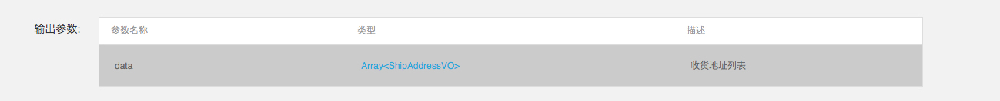

# 移动端NEI使用规则

## 命名规则

对于属性名字，需要避免与 `NSObject` 固有的属性与保留关键字重名.

### 一般命名规则

+ 类型名首字母大写，驼峰。
+ 属性和参数名首字母小写，驼峰。
+ 接口名首字母大写，驼峰。
**接口名称需要填写英文的，首字母大写，驼峰；之前的中文名字以及相关信息填到描述中去；（非常重要, 否则无法自动生成请求）**


### 数据类型中属性名、接口定义中参数命名避免 `NSObject` 属性与保留关键字

输入参数的名字会转换成为 `Request` 类的属性名, 输出参数的名字会转换成为 `Model` 类的属性名；因此，参数的名字应该避免与基类属性以及保留关键字重名。

1 新定义的属性不允许采用一下名字：
`hash`，`superclass`，`class`，`self`，`isProxy`，`description`，`debugDescription`，`retaincount`，`retain`，`release`，`autorelease`，`new`，`copy`，`mutablecopy`

尤其是这几个比较容易被采用：
**`description`，`hash`，`retaincount`**

**如果有可能，建议避免取 id 作为名字;**

代码自动生成的时候不会更改属性名字，因此上述规范需要被遵守。 "description" 是一个非常典型的例子。

### 数据类型中不同属性不允许重名

同上，数据类型中的属性会转为 `model` 类中的属性，因此不允许重名。


## 类型相关
1 整型和 `Boolean` 不要混用。
2 对于双精度浮点型，需要额外定义新的基本类型，不要直接使用 `Number`。

## 枚举的定义
现在 NEI 接口的枚举定义只提供了 `value`，没有提供 `key`；对于移动端接口的描述，后续必须同时提供 `value` 和 `key`。 (飞哥所在的前端技术组会在 NEI 上添加对枚举 `key` 的支持)。


## 服务器接口设计规则

### 接口设计
1 服务器接口需要支持，如果默认参数值为 `nil`，则允许不传递该参数，即服务器端自己需要加上对默认参数的支持，没有该参数时，当作默认参数处理。
客户端在没有参数值时，连 `key` 都不会传。

**2 接口名称需要填写英文的，首字母大写，驼峰；之前的中文名字以及相关信息填到描述中去；（非常重要, 否则无法自动生成请求）**

### 输出参数
1 返回的所有输出参数需要利用一个数据类型进行描述。
a 如果只有一个输出参数，那么这个输出参数对应确定的数据类型即可。
例如，在NEI上不描述code和message相关信息，只描述data, 那么参数描述如下：



也就是可以省略表示错误信息的 `code` 和 `message` 信息；


b 如果有多个输出参数，那么这多个输出参数需要包含在一个数据类型中；


NEI在自动生成代码的时候会根据 `ResultData` 是否包含可变类型来自动生成 `Request`；如果包含可变类型，那么只会针对可变类型进行 `ResponseMapping` 的映射；如果不包含可变类型，那么会针对整个 `ResultData` 进行映射；

c 如果有多个输出参数, 但是这么多个输出参数没有包含在一个数据类型中，那么自动生成的 `ResponseMapping` 为 `nil`，表明不会进行 JSON 到 Model 的转换，只会拿到一个固定的 JSON 文件

2 JSON 格式要求
a 在同一个接口中，同一个参数名只能对应一种类型；

例如某个请求A的返回如下, `result` 对应的仍然是 JSON

```javascript

	{
		"code": "200",
		"message": "UqLtbGJSfX",
		"result": {
			"id": 71227,
			"name": "TzgUmBzuJo",
			"parent": 46601
		}
	}
	
```	

那么即使出错，`result` 也应该按照相同的格式返回。例如，下面的返回就不允许, 因为 `result` 设计时对应的应该是 JSON 类型的，不是字符串类型的。

```javascript

	{
		"code": "200",
		"message": "UqLtbGJSfX",
		"result": "用户未登陆"
	}

```	

总结：同一个请求的同一个 `Key`，需要对应相同类型的 `Value`。

b 尽量采用标准的 JSON 格式，而不要采用异构的。
由于 NEI 定义了很多自定义的数据类型，所以不太存在该问题。


TODO：
1. 接口的描述和名称，在界面上显示的时候是否可以额外处理下，毕竟英文名称太难懂？
2. 是否支持对于 `double` 类型的额外新增自定义类型？
3. 和飞哥确定 `request` 自动生成的进度
4. 工程的集成与生成;(如何用 JS 进行工程的集成呢？)
5. 是否需要支持不同的命名？包括 Model, request (讨论结论：不需要额外支持)
6. 如果 Model 中属性名改了，如何自动更改关联的代码。 (讨论结论：手动修改, 不支持自动关联)