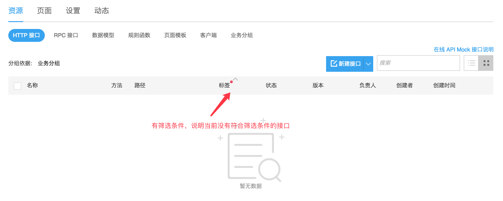

> 创建好的接口，有的人能看到，有的人看不到，这是怎么回事？

1. 首先确认一下接口的状态是否为“审核中”，如果是审核中的接口，则只有接口创建者、管理员、审核人员才能看到。

2. 如果接口的状态不是“审核中”，则看一下表头的筛选条件，只要看表头是否有红色的点就可以了：

> 在线 Mock 接口，返回 403 错误是怎么回事？

请参考：[相关 FAQ](./调用在线APIMock接口说明.md#faq)