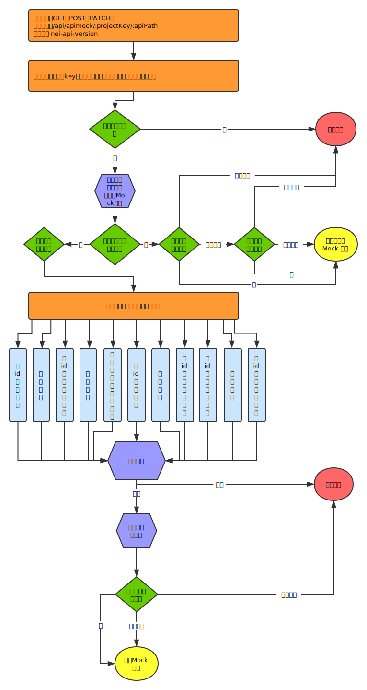

# MockStore

在正式介绍 MockStore 的实现细节之前，有几个概念需要提前理解一下：

###### 接口引用数据模型的方式

假设有一个数据模型 `User`，接口可以直接或者间接引用它：

- 直接引用：
  - 接口的请求参数或者响应结果的某个字段的类型是 `User`。
  - 接口的请求参数或者响应结果中导入了 `User`，包括在非第一层中导入（即在类型为 Object 的字段中导入）。
- 间接引用：
  - 接口的请求参数或者响应结果的某个字段是类型 `X`，`X` 本身又直接或者间接引用了 `User`。
  - 接口的请求参数或者响应结果中导入了 `X`，`X` 本身又直接或者间接引用了 `User`。

###### 接口关联数据模型的方式

不同于`接口引用数据模型`，只能在接口的详情页面的 `MockStore` 标签页面中设置接口和哪个数据模型关联。它是通过数据模型将独立的接口关联起来的功能。

MockStore 总共分为三部分的功能，分别是：

- Mock 数据持久化。
- Connect。
- 提供在线可跨域调用的接口，用于获取或者操作 Mock 数据。

## Mock 数据持久化

在 NEI 中，有好几个展示 Mock 数据的地方，比如接口的请求信息页面、接口的响应信息页面、数据模型的属性列表页面、页面模板的详情页面等等。我们并不需要将这些 Mock 全部保存下来，因为没有保存的必要，除了接口的响应结果的 Mock 数据，其他地方的 Mock 都是用来展示用的。MockStore 的 Mock 数据持久化功能，**只能用来保存接口的响应结果**，并且有以下使用限制：
- 只能保存类别为哈希或者数组的响应结果 Mock 数据，其他类别的响应结果，可以直接使用默认值的功能。
- 切换响应结果的类别后（比如从哈希修改为数组），会清空原来已经保存的 Mock 数据。
- 保存数据时，会验证将要保存的数据是否和定义一致，前后端都会验证，不一致的时候会有详细的提示信息：
  - 字段类型是否匹配。
  - 字段是否缺失。
  - 字段是否多余。
- Mock 数据保存在 NEI 的数据库（MongoDB）和缓存（Redis）中，展示时需要调用接口获取。
- 操作响应结果字段后，会同步更新数据库和缓存中的内容，前端会重新获取 Mock 数据，包括以下场景：
  - 更新响应结果字段的名称或者类型。
  > 注意，修改类型的时候，会将原来的值尽可能地按照新类型进行转换，这样误操作后还能尽可能地还原回来，但有些转换是不可逆的，比如将字符串 `abc` 转换为布尔类型后就是 `true`，此时再将它转换回来就是字符串的 `'true'` 了。
  - 增加响应结果的字段，字段的值按照定义随机生成。
  - 删除响应结果的字段。
  - 如果响应结果中导入了某个数据模型，隐藏数据模型的某个字段。
  - 如果响应结果中导入了某个数据模型，显示数据模型的某个字段，字段的值按照定义随机生成。
- 操作数据模型（包括匿名类型）字段时，会同步更新数据库和缓存中的内容，所有引用了它的接口的响应结果 Mock 数据，都会同步更新，就算数据模型和接口有关联，也会更新接口的 Mock 数据，这样做的好处是，的接口和数据模型取消关联时，接口的 Mock 数据依旧正确，前端会重新获取 Mock 数据，包括以下场景：
  - 更新数据模型（包括匿名类型）字段的名称或者类型。
  - 删除数据模型（包括匿名类型）字段。
  - 增加数据模型（包括匿名类型）字段，字段的值按照定义随机生成。
  > 注意，当接口和数据模型关联后，实际返回的 Mock 数据可能就不是在页面上录入的数据了，具体规则请参考 Connect 的描述。
- 当 Mock 数据被持久化保存后，再修改`默认值`、`生成规则`时，不会同步更新 Mock 数据。如果想按照新的定义重新生成，可以点击`刷新Mock数据`按钮重新生成 Mock 数据。
- 删除接口后，数据库和缓存中的 Mock 数据都会删除。
- 为了防止恶意使用，Mock 数据最大限制为 500KB。

## Connect

接口可以通过数据模型进行关联，从而接口之间能建立起联系，此功能称之为 Connect。这个数据模型，一般就是系统中的实体模型，比如用户模型 `User`、分组模型 `Group`、歌曲模型 `Track` 等。结合实际情况以及实现上的简洁性，对这个数据模型加了一些使用上的限制：
- 必须是 `哈希` 类别。
- 必须有 `id` 字段，并且 `id` 字段的类型必须是 String 或者 Number，也不能是数组。
- 数据模型被接口关联后，它的 `id` 字段不能更改名称，`id` 字段的类型只能在 String 和 Number 中进行切换。当然，也不能更改为非哈希类别。
- 数据模型被接口关联后，也不能删除这个数据模型。
- 如果删除的数据模型没有被接口关联，则也要考虑把它的 Mock 数据从数据库和缓存中删除，因为之前它可能被接口关联过，已经产生了数据。
- 操作被接口关联的数据模型时，会同步更新数据库和缓存中的 Mock 数据，包括所有引用了这个数据模型的接口的 Mock 数据、数据模型自己的 Mock 数据：
  - 更新数据模型属性的名称或者字段。
  - 增加数据模型属性。
  - 删除数据模型属性。

此外，在使用根据某个数据模型批量创建接口的 CRUD 功能时，数据模型和新创建的接口会自动关联。

接口和数据模型的关联方式，有以下 11 种情况：

- 按 id 加载单个
- 加载所有
- 按 id 列表加载多个
- 创建单个
- 按数组数据创建多个
- 按 id 更新单个
- 更新所有
- 按数组数据更新多个
- 按 id 删除单个
- 删除所有
- 按 id 列表删除多个

在讲解上面 11 种情况的实现细节时，我们先来看一下在线接口调用的过程示意图：



根据请求信息查找目标接口的过程，可以查看这篇文档的说明：[调用在线APIMock接口说明](https://github.com/NEYouFan/nei-toolkit/blob/master/doc/调用在线APIMock接口说明.md)。目前线上的实现是找到目标接口，就按照接口定义生成随机值返回了。MockStore 会继续往下判断接口是否关联了数据模型，同时也增加了前置业务逻辑脚本和后置业务逻辑脚本的功能，这两个脚本的功能之后再详细介绍。根据上面的实现示意图，我们知道：
- 如果接口没有和数据模型关联，则会判断有没有前置和后置的业务逻辑脚本，有就执行，没有就直接返回接口持久化的 Mock 数据。
- 如果接口已经和数据模型关联，则会按照关联的类型，进行相应的处理，之后的处理过程同上。

下面分别讲解 11 种关联类型具体是如何实现的。注意，在正式处理关联类型的逻辑之前，会执行前置业务逻辑的脚本，它的执行结果对某几中关联类型会有影响，具体见下面的描述。

#### 按 id 加载单个

先查找请求发送过来的 `id` 是什么值，它按照下面的顺序查找，找到就返回，不再继续往下找：

- **路径参数**。比如按照用户 id 加载用户数据的接口定义是 `GET /api/users/:id`，请求 Mock 数据的 URL 是 `GET /api/apimock/:projectKey/api/users/123`，路径参数对象为 `{id: 123}`，所以找到的 id 值是 123。
- **查询参数**。比如按照用户 id 加载用户数据的接口定义是 `GET /api/users?id=:id`，请求 Mock 数据的 URL 是 `GET /api/apimock/:projectKey/api/users?id=123`，查询参数对象为 `{id: 123}`，所以找到的 id 值是 123。
- **请求体**。比如按照用户 id 加载用户数据的接口定义是 `POST /api/users`，请求参数定义为：

```json
{
  "id": {Number}
}
```

请求 Mock 数据的 URL 是 `POST /api/apimock/:projectKey/api/users`，请求体为：

```json
{
  "id": 123
}
```

请求体是一个 json 对象，所以找到的 id 值是 123。

> 注意，接口和数据模型的关联类型，和 HTTP 协议本身的语义没有关系，比如加载数据，一般来说都使用 GET 方法，但 POST 也可以，甚至 DELETE 也可以，NEI 并不关心用户使用什么请求方式。

如果没有找到 id 值，就报错返回。

如果找到了 id 值，就拿着这个 id 去数据库中查找和这个 id 对应的数据，此时是通过`项目id`、`数据模型id`以及`请求id`三个条件去查的。

> 注意，id 值会根据数据模型中的 id 属性的类型进行转换，比如数据模型中的 id 属性是数值类型的，而从路径参数和查询参数中拿到的 id 肯定是字符串类型，此时会将字符串转换成数值。

如果没有找到目标数据，则报错返回。否则就拿到了 Mock 数据。之后的处理逻辑，11 种场景都是一样的，我们最后再来介绍。


#### 加载所有

通过`项目id`和`数据模型id`，查找目标数据模型的所有的 Mock 数据即可。


#### 按 id 列表加载多个

先查找请求发送过来的 `ids` 是什么值，查找过程同查找参数 `id` 的过程。ids 的值要求是一个数组，比如：`POST /api/apimock/:projectKey/api/users`，请求体是：

```json
{
  "id": [123, 234]
}
```

如果找到的 ids 是字符串，则会将字符串按逗号 split 为数组，比如，请求 URL 是 `GET /api/apimock/:projectKey/api/users?ids=123,234`，拿到的 ids 是字符串 `123,234`，则最终 ids 的值是 `[123,234]`。字符串前后以及逗号两边都可以有空格，处理时会调用字符串的 trim 方法处理。

如果没有找到 ids 值，就报错返回。如果找到了，就去查与之对应的数据模型列表，从而拿到了 Mock 数据。


#### 创建单个

首先会判断数据模型的 Mock 数据条数是否已经超出限制，目前每个数据模型最多只能创建 1000 条。

然后会查找请求发送过来的数据，查找过程如下，找到就返回：

- 前置业务逻辑脚本返回的数据。
- 取请求体的 `data` 字段。
- 取整个请求体的数据。

如果最终找到的结果不是普通的 json 对象或者是一个空对象，则报错返回。

否则，考虑到请求数据有可能和数据模型的定义不一致，所以会按照数据模型的定义获取数据：
- 删除 id 字段。id 由程序生成，是数字或者数字形式的字符串，这样 id 在字符串和数值之间切换时，可以无损切换了。生成 id 的算法采用了低成本实现，理论上会有冲突的可能，实际冲突的可能性比较小，所以对 MockStore 这样的场景，问题不大。
- 过滤掉多余字段。
- 字段可以缺失。
- 字段名称和类型必须和定义匹配，包括数组类型也要匹配。

如果有不符合定义的情况，则报错返回。

否则，再检查要创建的数据的大小是否超过 500KB，超过的话就报错返回。

之后，生成一个新的 id，赋给处理好的数据对象，然后就将这个对象数据保存到数据库中。最终拿到的是新创建的 Mock 数据。


#### 按数组数据创建多个

过程和 `创建单个` 一致，只不过换成批量创建罢了。不过，有点细微区别，就是数组数据的查找方式，多了一种查找请求体的 `items` 字段的过程，即查找过程是：

- 前置业务逻辑脚本返回的数据。
- 取请求体的 `data` 字段。
- 取请求体的 `items` 字段。
- 取整个请求体的数据。

如果数据不存在、或者不是数组、或者长度为 0，就报错返回。

#### 按 id 更新单个

先查 `id` 参数的值，查找过程和 `按 id 加载单个` 一致。

查找请求数据的过程和 `创建单个` 一致。

然后是更新目标 id 的数据，最终拿到的是更新后的数据。

#### 更新所有

查找请求数据的过程和 `创建单个` 一致。

然后是更新关联的数据模型的所有 Mock 数据，最终拿到的是更新后的 Mock 数据列表。

#### 按数组数据更新多个

请求数据的查找过程和 `按数组数据创建多个` 一致。

此时，请求数据数组的每一项都要有 id 字段，否则会报错返回。

然后就是将目标 id 数据更新为请求发送过来的最新数据，最终拿到的是更新后的 Mock 数据列表。

#### 按 id 删除单个

先查 `id` 参数的值，查找过程和 `按 id 加载单个` 一致。

然后是将目标 id 对应的数据删除，最终拿到的是被删除的数据。


#### 删除所有

将目标数据模型的所有 Mock 数据删除，最终拿到的是被删除的数据列表。


#### 按 id 列表删除多个

先查 `ids` 参数的值，查找过程和 `按 id 列表加载多个` 一致。

然后将目标 ids 数组对应的 Mock 数据删除，最终拿到的是被删除的数据列表。


以上就是所有 11 种情况的具体实现。按照上面的请求示意图，拿到处理结果的 Mock 数据后，还要经过后置业务逻辑脚本的处理，之后再将数据返回给客户端。下面我们就来看前置和后置业务逻辑脚本的具体实现。


## 前置业务逻辑脚本

前置业务逻辑脚本，会在业务逻辑代码之前执行，可用于：

- 参数合法性检查。
- 添加一些无法在前端业务逻辑中添加的字段，比如 createTime。

前置业务逻辑脚本，在 NEI 平台通过 `规则函数` 指定，它是一段 JavaScript 代码，和生成规则类似，它也有一些使用限制：

- 如果执行过程中有错误发生，则会把错误信息放在响应结果的 `_nei_apimock_error` 字段中。比如有语法错误等。
- 如果执行过程花费的时间超过 1000 毫秒，则会报超时错误，此时响应结果是 `Script execution timed out.`。比如规则函数代码中有死循环。

在执行规则函数的时候，会注入一个参数，它是一个对象，具体的值分为两种情况：

> 注意，在规则函数中，可以通过 arguments[0] 获取到注入的参数对象，即：

```js
const options = arguments[0];
```

- 如果接口没有和数据模型关联，此时注入的参数对象为：

```js
{
  req: {
    method: '[请求方式]',
    query: '[请求的查询参数]',
    body: '[请求体]',
    apiPath: '[在 NEI 平台上面定义的接口路径]',
    url: '[请求的完整 url]',
    headers: '[请求头信息，其中包含了 cookie 字段]',
    apiPathVars: '[路径参数对象]'
  }
}
```

- 如果接口关联了数据模型，此时注入的参数对象，除了包含上述的 `req` 对象外，还包含：

```js
{
  models: '[见下方的说明]',
  allModels: '[见下方的说明]'
}
```
  - models：和当前接口关联的数据模型的所有 Mock 数据列表
  - allModels：当前接口所在的项目中的所有数据模型的 Mock 数据列表，如果接口关联的是公共资源库的数据模型，则还包括公共资源库中的所有数据模型的 Mock 数据列表。但不包含接口所关联的数据模型的 Mock 数据列表。它是一个对象，对象的键是数据模型的名称（小写），值是对应数据模型的 Mock 数据列表。

脚本可以不返回值，也可以返回一个对象，格式如下：

```js
{
  error: '[错误信息，比如参数检验错误等]',
  data: '[接下来优先使用的数据]'
}
```

当脚本执行异常或者返回的对象中有 `error` 字段时，会报错返回。此时的错误信息会放到 `_nei_apimock_error` 中。

当脚本返回的对象中有 `data` 字段时，则在接下来的处理过程中，会优先使用这个值，比如 `创建单个` 中的处理。

> 小技巧，如果写规则函数的时候，想看传入的参数对象都包含了哪些信息，可以先返回 `{error: true}`，此时接口的返回信息中会包含 `options` 字段，它就是注入给规则函数的参数。


## 后置业务逻辑脚本

后置业务逻辑脚本，会在业务逻辑代码执行完后执行，它可用于：

- 数据返回前的处理，比如分页逻辑的实现。

注入给后置业务逻辑的规则函数的参数对象，同样分为两种情况：

- 如果接口没有和数据模型关联，此时注入的参数对象，除了和前置业务逻辑脚本相同的 `req` 对象外，还包含：

```js
{
  resData: '[接口的 Mock 数据]'
}
```

- 如果接口关联了数据模型，此时注入的参数对象，除了和前置业务逻辑脚本相同的 `req`、`models` 和 `allModels` 对象外，还包含：

```js
{
  resData: '[前面所讲述的 11 种关联类型处理完后拿到的数据]'
}
```

和前置业务逻辑脚本一样，后置业务逻辑脚本也可以不返回值，也可以返回一个对象，处理过程也一样。

如果后置业务逻辑脚本返回的对象中有 `data` 字段，只要它的值不是 `undefined`，则接口最终返回的就是 `data` 字段的值，此时我们用户的处理过程，不再对数据进行任何处理。

## 返回数据的填充规则

按照前面的接口请求的过程示意图，我们知道在处理完 11 种关联类型后，还会按照接口的定义返回符合接口定义的数据。这是因为，就拿`创建单个`来说，将数据保存到数据库后，最终拿到的是新创建的数据，此时接口定义的响应结果可以是任意的，如果用户只定义了返回 `code` 字段就可以了，我们就不应该返回新创建的数据。

返回数据的填充规则，以实际示例说明如下：

获取关联数据模型的所在路径，可以有多条路径，比如创建用户的接口，最常见的返回值为：

```json
{
  code: { Number },
  message: { String },
  result: { User }
}
```
但返回值也可以是任意的，比如:
```json
{
  code: { Number },
  message: { String },
  result: {
    data: { User }
  }
}
```
或者：
```json
{
  code: { Number },
  message: { String },
  result: {
    data: { XUser }
  }
}
```
> 其中 XUser 是一个扩展后的 User 对象，也就是它导入了 User。

或者：
```json
{
  code: { Number },
  message: { String },
  result: { Array|{ User } }
}
```
或者：
```json
{
  data: { User },
  data1: { User },
  result: { User }
}
```

总之，要把所有出现 User 的地方全部替换为新创建的 `User` 数据。