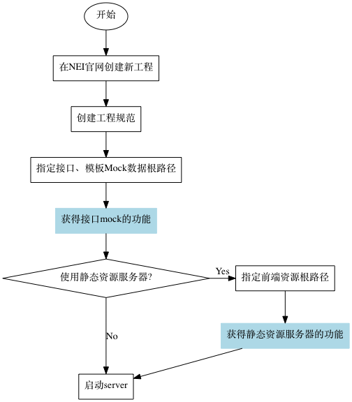
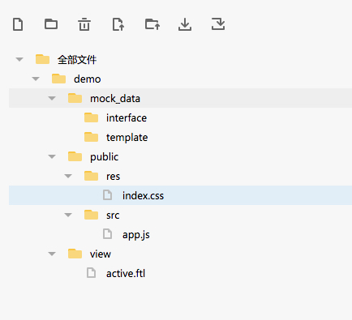
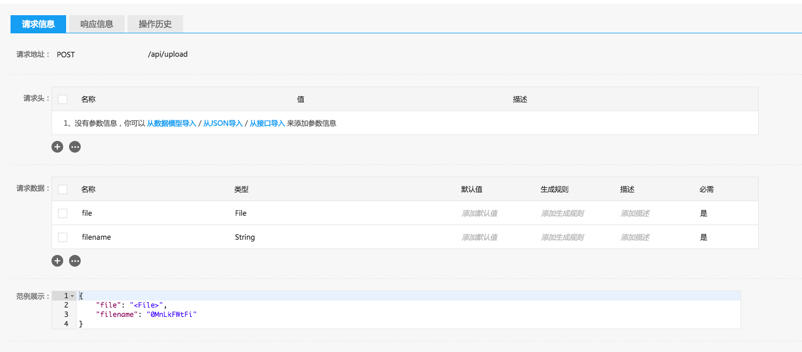
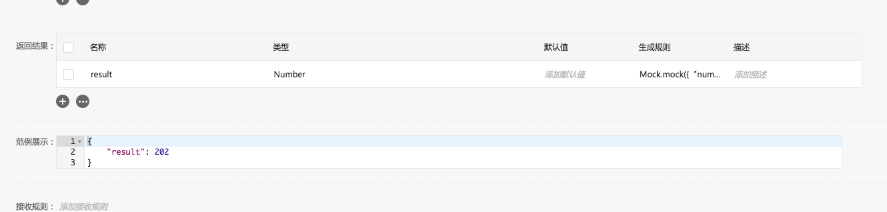
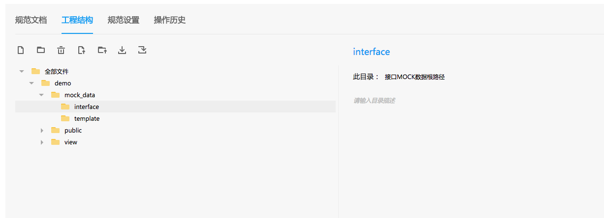
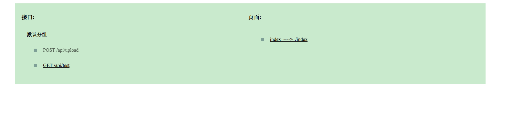

<h2>Table of Contents</h2>

<ul>
<li><a href="#orgheadline10">1. 前言</a>
<ul>
<li><a href="#orgheadline1">1.1. 常见步骤</a></li>
<li><a href="#orgheadline2">1.2. 创建项目</a></li>
<li><a href="#orgheadline4">1.3. 创建工程规范</a>
<ul>
<li><a href="#orgheadline3">1.3.1. 创建工程结构</a></li>
</ul>
</li>
<li><a href="#orgheadline7">1.4. 使用Mock服务器功能</a>
<ul>
<li><a href="#orgheadline5">1.4.1. 创建需要的接口</a></li>
<li><a href="#orgheadline6">1.4.2. 指定接口Mock根目录</a></li>
</ul>
</li>
<li><a href="#orgheadline8">1.5. 静态服务器配置</a></li>
<li><a href="#orgheadline9">1.6. 上传mock功能</a></li>
</ul>
</li>
</ul>

# 前言

在之前的文章[使用NEI进行前后端并行开发](./使用NEI进行前后端并行开发.md)中，我们简单介绍了如何使用NEI搭建mock服务器。然而，可能是篇幅过小，很多同学在使用中还是碰到一系列问题。 本篇文章希望通过一个简单的教程，从零开始搭建一个可用的Mock服务器, 并简单介绍下如何使用各模块的功能。

## 常见步骤

使用NEI的常见步骤如下图所示，以下章节将对每一步流程进行介绍。

## 创建项目

NEI作为团队协作的利器，将团队映射为项目组，同一个项目组中包含有相近的几个项目。同时为了复用接口、数据模型、页面等资源，在新建项目组的时候，我们同时为您创建了一个公共资源库。公共资源库中的资源对所有该项目组下的所有项目可见、可用。

现在我们新建一个项目,取名为"nei-toolkit-demo",并点击进入该项目。

## 创建工程规范

当需要nei命令为您提供Mock服务器功能时，您需要创建一个工程规范。 我们这里直接生成一个新的工程规范，取名为\`nei-toolkit-demo工程规范\`, 并制定其实现语言为Nodejs, 模板引擎为EJS, 模板扩展名为默认的ejs. 该工程规范我已经共享了，你可以在工程规范中搜索找到，以作参考。

### 创建工程结构

根据需求，创建的工程目录如下:

文件目录说明如下:

-   demo: 项目名称
    -   mock\_data: 接口、模板Mock数据根路径, 在下一节中将会讲到
        -   interface: 接口mock数据根路径
        -   template: 模板Mock数据根路径
    -   public: 前端资源文件存放文件, 在静态服务器设置一节中将会讲到
        -   res: css、image等资源路径
        -   src: js代码存放路径
    -   view: 模板存放路径

这里的目录结构并不是必须的。你可以依照自己的框架或者习惯定制或上传生成工程规范。唯二需要注意的是下文中讲解的\`接口、模板Mock数据根路径\`以及\`静态资源存放路径\`,这两个路径必须指定，不然不能启用对应的功能，具体指定方法见下文讲解。

## 使用Mock服务器功能

### 创建需要的接口

Mock是对接口的模拟服务。 首先我们需要创建需要使用的接口。 在本例子中，我们创建两个接口,其配置如下

1.  名称: test, 路径: GET, /api/test
2.  名称: 文件上传， 路径: POST, /api/upload

对于每个接口，设置其请求信息和响应信息，如/api/upload接口的请求信息设置为:

请响应信息设置为:

通过将请求信息中的file字段类型设为File类型, 我们就能实现对文件上传的模拟。
/api/test接口的设置也大概如此,这里不再赘述

### 指定接口Mock根目录

在创建好接口之后，我们还需要有一步步骤才能启用接口Mock服务器功能。
回到之前创建的\`nei-toolkit-demo工程规范\`, 将文件夹 /demo/mock\_data/interface指定为接口Mock数据根目录。 如下图所示:

回到工程的设置页，将它的web工程规范指定为\`nei-toolkit-demo工程规范\`，另外在工具标识一栏生成有一构建命令，本项目的构建命令如下:

    nei build -k 3bb059d1d1cd799abcda4550e2b1f04c

在terminal中执行该指令，nei将生成该工程，进入生成的目录，执行nei server，这时， nei将唤起浏览器，并自动打开页面, 该页面将所有的接口、页面都显示出来。如下图所示:

此时你可以直接接口或者页面进入。比如我点击GET /api/test这个接口，其超链接地址为: <http://localhost:8002/api/test>, 显示的结果即为之前设置mock的数据。 至此，我们已经完成了Mock服务器的配置。接下来你就可以愉快地使用NEI进行前后端并行开发了。

## 静态服务器配置

如果你的前端框架没有支持静态服务器的话，nei同样也提供了这方面的支持。如果你想使用该功能，回到工程规范中，创建一个文件夹，并将该文件夹设置为\`静态资源根路径\`, 并将您所有的静态文件都存放在该目录中。那样当你执行nei server的时候，该目录下的文件都将可以被访问。 如本工程中，其静态资源相关的目录结构如下:

-   demo
    -   public
        -   res
            -   index.css
        -   src
            -   app.js

该工程规范设置public文件夹为\`静态资源根路径\`， 此时执行nei server， app.js的路径则为/src/app.js。可以通过<http://localhost:8082/src/app.js> ,即可访问到该路径。

## 上传mock功能

在你执行上面的构建命令构建该demo工程后，你可以运行看看。该项目在启动后，有个index页面，其中实现了文件上传的mock功能。因为一般都是本地启用mock服务器，因此上传的速度极快，为保证mock效果，建议通过chrome或Charles等代理将网速限制慢些。如果你有兴趣的话，欢迎玩玩。
