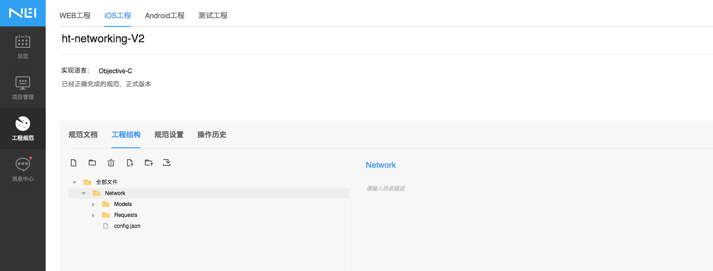
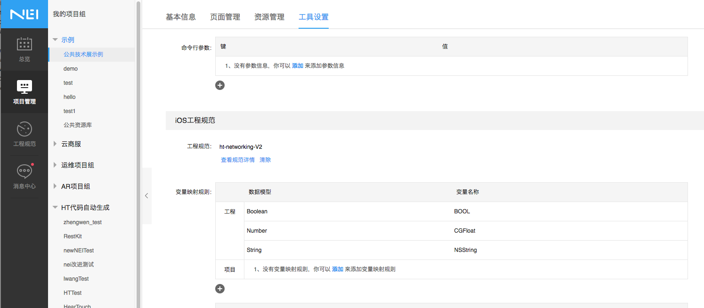
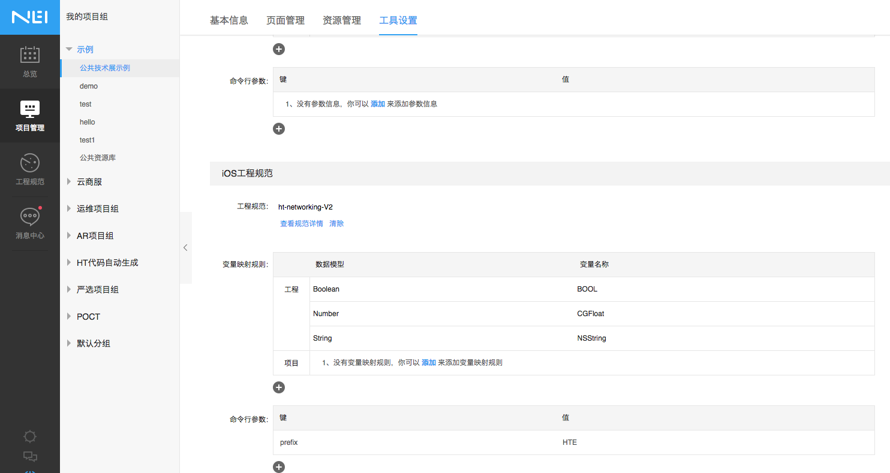
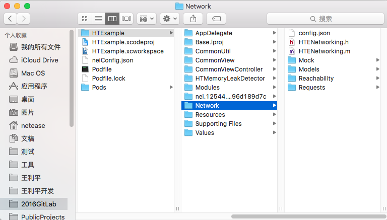
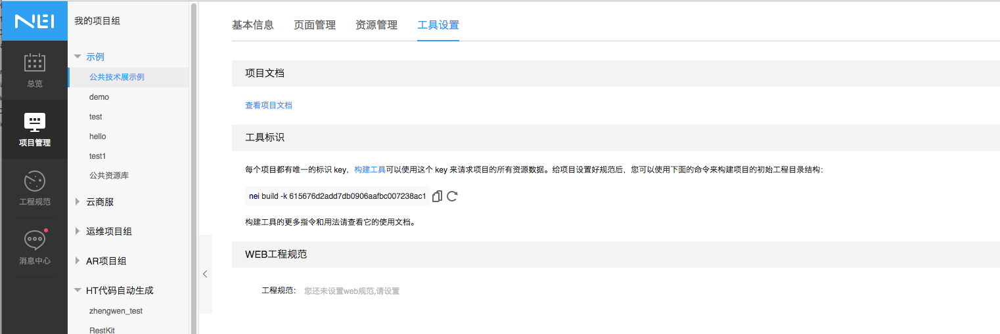
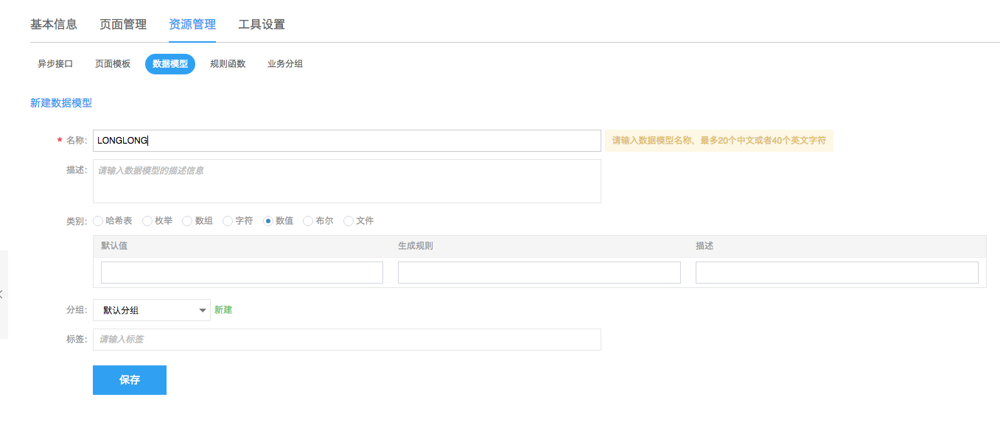

# nei mobile新版本使用指南

## 一 安装nei-toolkit的新版本

### 环境配置

构建工具基于 Node.js 平台，因此需要先安装 Node.js 环境，Node.js 在各平台上的安装配置请参阅官方说明。

安装的 Node.js 版本须为 v4.2 及以上

### 安装

	$npm install nei –g
	
提示1: 如果安装不成功, 可以尝试命令 `npm install -g nei`

提示2: 如果已经安装过 nei, 请使用更新命令 `npm update nei -g`

更多详细命令以及所依赖的版本请参见[nei-toolkie](https://github.com/NEYouFan/nei-toolkit)

## 二 编辑工程规范

首先在Nei接口管理平台为项目指定iOS工程规范，iOS工程规范的编写可参考[NEI 接口管理平台配套自动化工具NEI工程规范介绍](https://github.com/NEYouFan/nei-toolkit)。 不同的网络库拥有不同的Request／Model的组织结构，对应的工程规范结构自然也不一样。

以下为针对HTNetWorking网络库的工程规范的使用示例：

直接使用iOS工程规范[ht-networking-offical](https://nei.netease.com/spec/detail/template/?id=10781)或者拷贝该工程规范后进行修改。

建议直接使用该工程规范，即使自己拷贝一份后进行修改，请仅仅修改`规范设置`中的`变量映射规则`与'config.json'这个命令行参数配置文件.

Note：请应用开发人员不要直接修改该规范，可以拷贝一份后再作修改

## 三 编辑工程配置

在项目管理中，找到对应的项目，在项目的工具设置中指定对应的iOS工程规范，变量映射规则以及与项目相关的命令行参数; 

也可以设置与项目相关的命令行参数来覆盖iOS规范中指定的默认命令汗参数，如图：

具体可供指定的参数可以参见规范中的config.json文件。常见的有以下几个：

1. `baseModel`: 生成的Model的基类，默认值为`HTHTTPModel`.
2.  `prefix` : 生成的数据模型与接口代码的前缀，默认值为`HT`
3. `baseRequest`: 生成的Request的基类，默认值为`HTBaseRequest`
4. `author`: 生成的文件中注释的作者名，默认为`Netease`.

## 四 执行命令生成文件

### 3.1 第一次执行

在项目目录下执行下面的命令生成Models和Requests请求代码
	
	$ nei build -k 615676d2add7db0906aafbc007238ac1 --specType ios -w true -o HTExample/ -iosProjectPath ../
	
如果不是第一次执行，但希望重新生成，需要先删除所展示的`nei.12544.7bd894ce1716869436df29796d189d7c`的文件夹。

### 3.2 后续更新代码

在项目目录下执行下面的命令更新Models和Requests请求代码
	
	$ nei update -k 615676d2add7db0906aafbc007238ac1 --specType ios -w true -o HTExample/ -iosProjectPath ../
	
### 3.3 命令说明:

#### 参数格式说明

1. nei: 工具名，固定
2. update: action名，第一次使用build, 后续使用update
3. -k 615676d2add7db0906aafbc007238ac1: 项目的key; 项目的key值请在`项目->工具设置->工具标识`中获取到, 如下图所示：
	
4. --specType ios: 规范类型，表明是生成iOS代码
5. -w true: 接口或者数据模型发生变化时，是否覆盖已生成的文件；默认选择true即可;
6. -o HTExample/: -o后接的是生成文件的路径，可以直接填写输出文件的路径相对于命令行当前所在路径的相对路径;
7. -iosProjectPath ../ : -iosProjectPath后接的是工程文件相对于生成文件(-o指定)的相对路径.

关于-o和-iosProjectPath, 请参见下面的项目目录说明。

8. 可选参数 --pbxForce: 添加--pbxForce时，即使生成的文件夹没有更新也会强制更新工程文件.

		$ nei update -k 615676d2add7db0906aafbc007238ac1 --specType ios -w true -o HTExample/ -iosProjectPath ../ --pbxForce

#### 项目目录说明

以下图为例，默认情况下iOS规范生成的接口与数据模型文件根目录为`Network`:

在下图所展示的工程所在目录下执行nei命令:

那么，那么生成的文件目录是HTExample/Network，也就是生成文件相对于执行命令时的目录的相对路径为`HTExample/`, 因此上述命令中对应的参数是`-o HTExample/`；  
而工程文件`HTExample.xcodeproj`所在的目录就是执行命令时所在的目录，该目录相对于`Network`文件夹的相对路径为`../`, 因为对应的参数`-iosProjectPath ../`.

注意：`-iosProjectPath`永远都是`.xcodeproj`相对输出目录的相对路径；而不是相对`Network`文件夹的路径，例如对于该规范`https://nei.netease.com/spec/detail/template/?id=10242`, 由于这是包含了完整工程的规范，因此，输出目录为`MyTestProjectSample`, 而`.xcodeproj`相对于该输入目录的路径一直都是`MyTestProjectSample/`, 因此执行命令的时候，可以采用下面的命令来指定`-iosProjectPath`:

	$ nei build -k dfb5802b7fc3e192dcb21f107bbe79a5 --specType ios -iosProjectPath MyTestProjectSample/
	
甚至，可以更进一步，在命令行参数配置文件里指定参数`-iosProjectPath`如下图，这样在输命令的时候就可以省略掉该参数了.

	

## 五 高级功能

1. 自定义基本类型

可以在新建数据模型时自定义新的基本类型，例如下图中可以新建一个新的数值类型：

新建基本类型后，必须在项目的`工具设置`中，为该类型添加映射规则，否则无法正确生成映射后的代码，映射规则如下：

这样该自定义的基本类型就可以在自动生成代码时候自动映射成为NSInteger了.

## 七 Known issues

1. 如果数据模型和接口都没有变化，那么仅更改了前缀名，不会删除之前生成的Models和Requests文件；
（这个需求需要讨论下是否需要实现， 因为当有变化的时候，就会更新为最新的了）

	