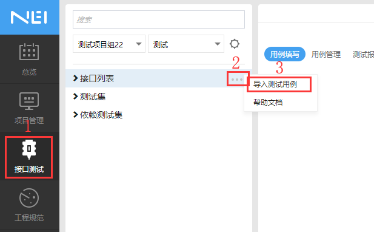
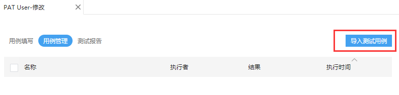

# 在NEI中导入接口的测试用例
NEI 平台目前支持 NEI 自定义的开放标准来批量导入测试用例。
## 导入的入口
你可以在接口测试中左侧的接口列表树的`接口列表`一栏导入测试用例，也可以点开单独一项待测试的接口，在`用例管理`里，点选`导入测试用例`导入。  
  
  
* 注意：两种导入方式有一点小小的区别，第一种导入测试用例可以导入当前项目任意接口的任意测试用例，而第二种只能导入当前标签页所示接口（见第二张图左上角的`PAT User-修改`）的测试用例。  

## 导入 JSON 文件
导入的格式为JSON文件，为了区分不同接口，使用了接口的请求方法（`method`）和接口的请求路径（`path`）进行区分，其表现与 [NEI MockStore](./mockstore.md) 中一致。
### 文件的数据格式
导入测试用例，其格式是一个对象，其中对象的`key`表示测试用例的所属接口，是用`method path`的形式标识，这个path可以是真实的路径而不需要显示写出对应的路径参数，路径参数可以通过用例的pathParams来设置，简而言之，`key`只用来标识是哪个接口，而对其他并没有影响。这个`key`对应的值是一个数组，表示需要导入该接口的用例列表。

```text
{
  "GET /api/users/": Array<NEITestcase>
}
```

#### NEITestcase

```javascript
class Testcase {
  name: string;
  description: string;
  pathParams: object;
  reqHeaders: object;
  reqData: object;
  resExpectHeaders: object;
  resExpect: object;
}
```
这里对每一项进行说明

| 属性 | 含义 |
| ---- | ---- |
| name | 测试用例的名称，若提供，则使用提供值，否则会自动生成，格式为【接口名-时间名-序号】，您也可以在导入确认框中再进行修改 |
| description | 测试用例的描述 |
| pathParams | 用例的路径参数，是一个对象，对象的key表明路径参数的名称，对象的value表明对应的值 |
| reqHeaders | 用例的请求头，是一个对象，对象的key表明请求头的名称，对象的value表明对应的值 |
| reqData | 用例的请求数据，是一个对象，对象的key表明数据的名称，而值则是对这个数据的说明，也是一个对象，value表明数据的值，ignored表明该数据是否不发送 |
| resExpectHeaders | 用例的期望响应头，是一个对象，对象的key表明响应头的名称，而值则是对这个响应头的说明，也是一个对象，value表明响应头的期望值，error表明该响应头在测试失败时的提示值 |
| resExpect | 用例的期望响应数据，是一个对象，对象的key表明数据的名称，而值则是对这个数据的说明，也是一个对象，value表明数据的期望值，error表明该数据在测试失败时的提示值 |

如一个示例数据如下 
```json
{
	"PATCH /api/users/1": [{
    "name":"测试用例1",
    "description": "更新用户信息",
    "pathParams": {
      "id": 10
    },
    "reqHeaders": {
      "Content-Type": "application/json"
    },
    "reqData": {
      "name": {
        "ignored": false,
        "value": "John"
      }
    },
    "resExpectHeaders": {},
    "resExpect": {
      "name": {
        "value": "John",
        "error": "Unexpected name!"
      }
    }
  }]
}
```
