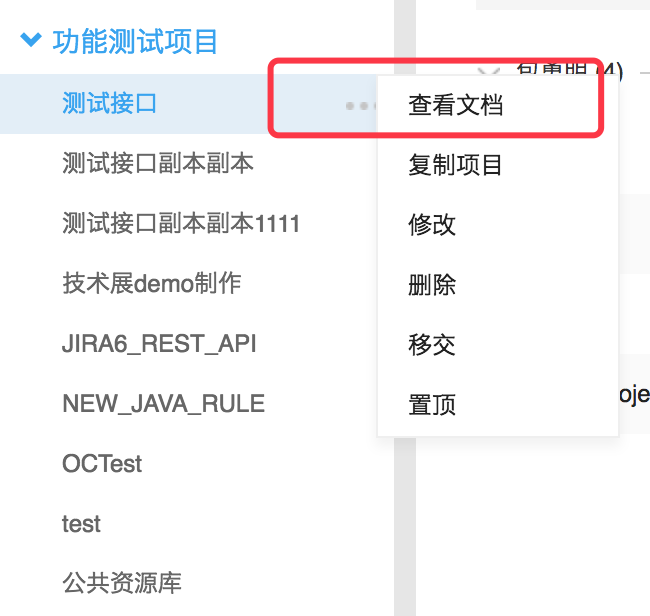
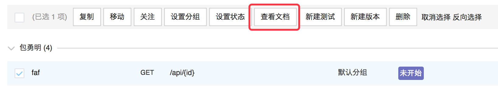
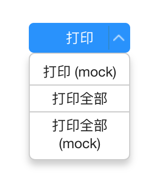
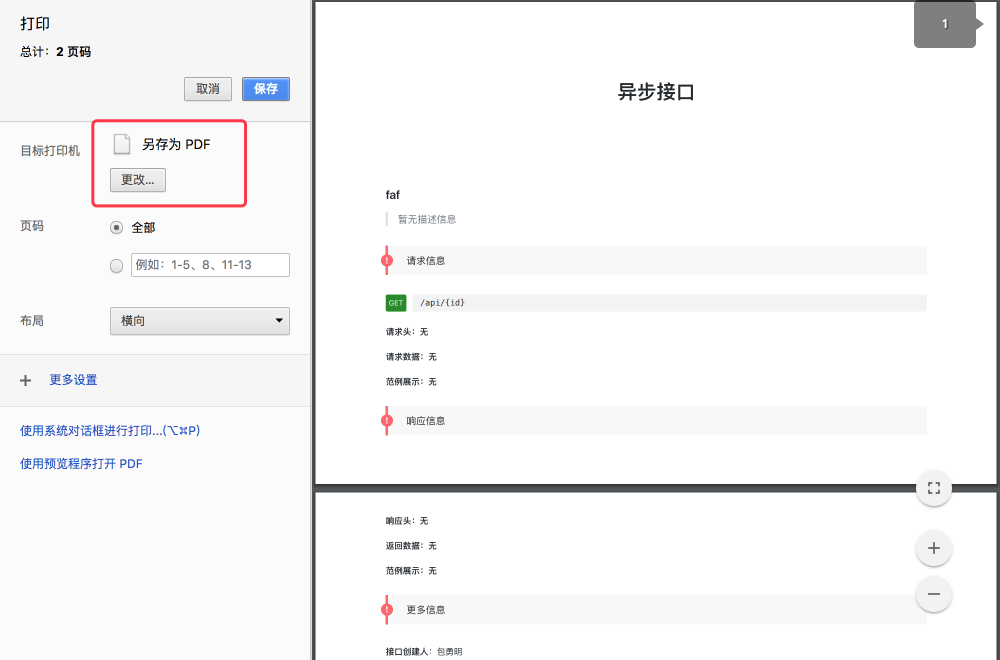

# 查看项目文档

1. 进入某个项目时，依次选择  菜单 -> 查看文档，就可以查看项目的文档了：

2. 或者，选择某个接口后，点击“查看文档”，可以查看某个接口的文档：

# 导出为 PDF

NEI 并没有提供导出功能，不过可以借助浏览器的打印功能。以 Chrome 浏览器为例，在项目文档页面，选择右上角的“打印”，根据自己的要求，可以选择打印不同的内容：

在打印界面中，目标打印机选择保存为 PDF 即可：

