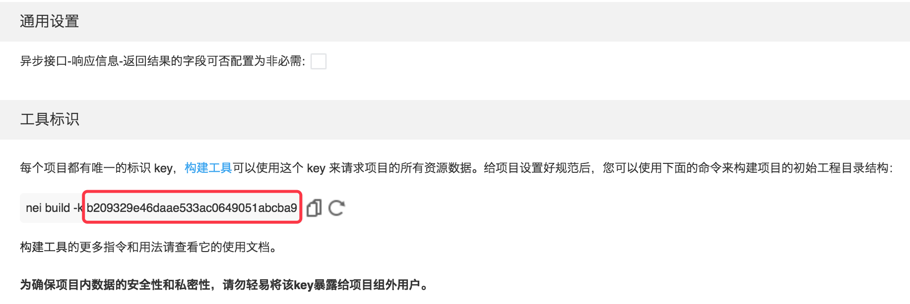

NEI 的项目有唯一标识 Key，可用它来获取项目以及项目中的资源。所以，请不要泄漏项目的 Key，不然其他人就能获取到你的项目的信息了。隔段时间重新生成 key 是个好习惯。

项目的 Key，在 `设置` 中查看，它的地址是：

```
https://nei.netease.com/project/tool/?pid=[项目Id]
```

> 注意，如果你在项目中的角色是 `观察者`，则没有 `设置` 标签，而是 `工具` 标签。

项目的 Key 就是下图红框中的内容：

